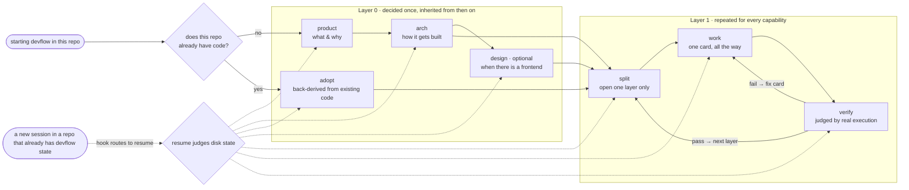
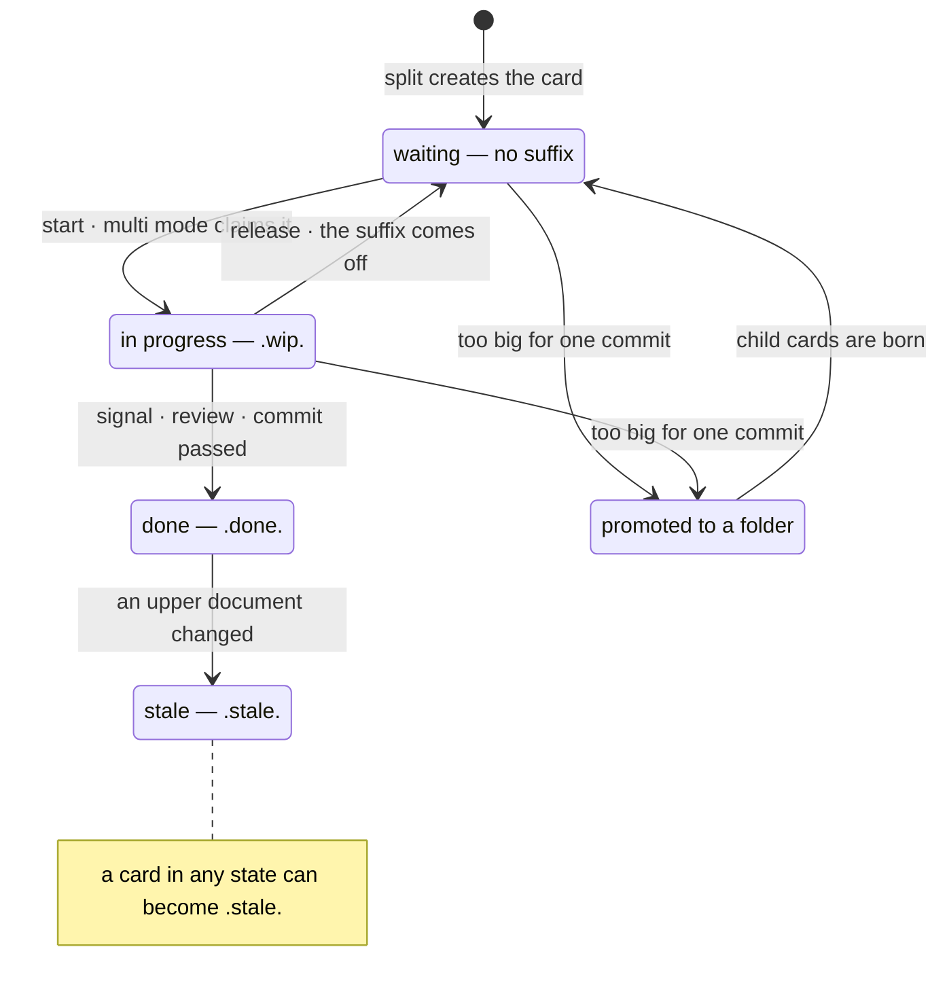
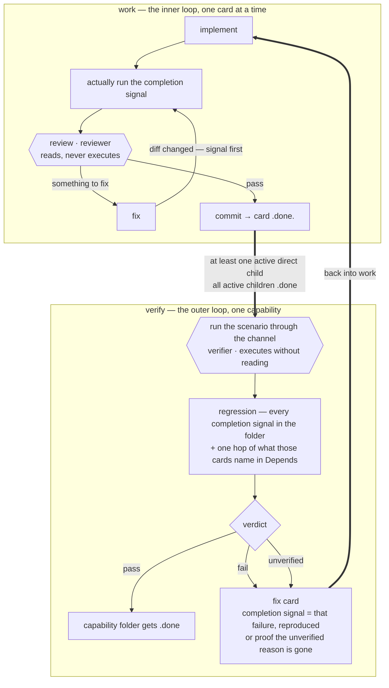
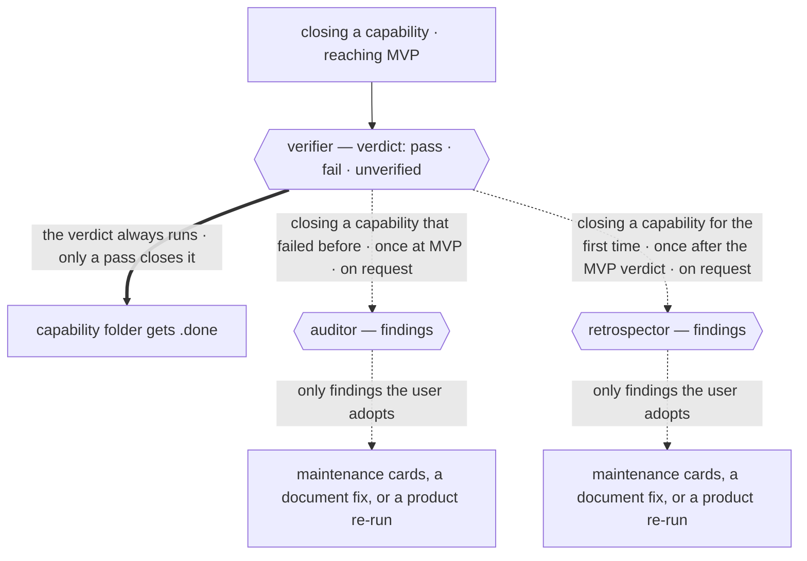

# devflow

> A development flow for AI sessions, connecting planning → implementation → verification. Supports Claude Code · Codex CLI.

[한국어](README_ko.md) · **English**

Every AI session starts with its memory wiped. devflow accumulates that memory **on disk,
not in conversation** — documents answer what you are building, the file tree answers how
far you have come, and the records answer why it was decided that way. Whenever a session
dies, the next one reads a small, fixed set of files and picks up where it left off.

## The approach — rich direction, minimal harness

Today's top models already know how to implement. The more tightly you script the
procedure, the more the model stops judging and starts following. devflow goes the
other way: make clear what must become true (the Destination), what must not happen
(Forbidden — 3 lines max), and how done is known (an executable completion signal) —
and **never prescribe the method.** It is the smallest set of devices that keeps the
work flowing in the intended direction without getting in the model's way.

| Made explicit | Left to the model |
|---|---|
| Destination — what must become true | implementation method and code patterns |
| Forbidden — 3 lines max | the choice of tools and paths |
| Completion signal — an executable check | the order of solving |
| Coordinates · Identity — part of what? | every point that needs judgment |

This split is the baseline for the standard tier (T-mid) and above — models are named
only as tiers T-high/T-mid/T-low, and the actual mapping is chosen in split's
execution proposal. The harness scales inversely with model tier: the lower the tier
a card is written for, the more Read-first, ordering hints, and prohibitions it carries.

Light does not mean unstructured. Review and verification run in independent contexts
that never saw the implementation history; what was not executed is not "passed" — it
is "unverified"; and the harness grows one step only on a defect actually met — never
on imagined risk. How the loops turn, and what every pass leaves behind, is one table
in the work ⇄ verify section below.

## The flow



| Situation | Entry point |
|---|---|
| New project | product, then in order |
| Adopting in an existing project | adopt (back-derive from code) → split |
| Adding or extending features | split |
| Continuing in a new session | automatic (SessionStart hook — see the install section), or resume |
| A teammate joins | make a room — see "Using it in a team" below |

Nothing on disk yet and you ran resume anyway? It asks one question and sends you to product
or adopt. It is also the safety net when you are not sure where you are.

### The first step — starting fresh vs adopting into existing code

**A new project** starts with an interview: product asks about the problem, the
capabilities, and the success criteria (questions come in batches, every question with
a default attached), arch decides the stack, structure, and verify channel, and split
runs three times (capability waiting files → `01-foundation/` with its direct cards →
the first capability's cards), with the work ⇄ verify loop starting after the second. So
the first cards you implement are repo setup and the verify channel.

**A project that already has code** starts with reverse-derivation instead of an
interview: adopt enumerates capability candidates and traces one representative flow
through the code end to end for each candidate, then
reverse-derives product.md · arch.md · code-style.md · glossary.md — product.md is filled in the
product skill's own format, and only what code cannot answer (will-not-build · success
criteria · gaps in Problem and Approach) is asked of the owner. The owner must answer the
success criteria, and each must be verifiable as written. adopt asks again until they are,
and does not move on to the arch derivation until they pass. Only the other unanswered
items stay in Open questions. Already-finished code is never backfilled
into the tree — the tree accumulates only work done after adoption. From there the
path is the same: split → work ⇄ verify.
Existing handoff and specification files are not copied. adopt indexes only their exact
paths by capability in `arch.md`; a change opens one only after rechecking it against
current code and naming it in the card's `Read first`. The old record system remains
usable without gaining global read cost or canonical standing.
When tracked post-adoption work finishes, devflow closes that work and waits. It opens
product-layer verification for the existing service only on an explicit user request.

## What accumulates in your project

Using devflow creates a single `devflow/` folder in the target project, and documents
accumulate hierarchically inside it:

```
devflow/
  project/                     ← Layer 0 output — upper documents that rarely change
    product.md                    what & why (capability list · success criteria)
    arch.md                       how (stack · structure · Provisional values · verify channel)
    design.md  code-style.md      (optional) design · code taste declarations
    glossary.md  decisions/       glossary · ADRs
  tree/                        ← canonical progress state — the filename IS the state
    01-foundation/                foundation (shared groundwork)
    02-payment/                   one capability = one folder
      02.1-model.done.md            a completed card
      02.2-api.wip.md               a card in progress (its progress log lives inside)
      02.3-webhook.md               a waiting card
      verify.md                     capability verification record (left by verify)
    03-reporting.md               one-heading waiting file for an unopened capability
  journal.md                   ← one-line cross-task decisions + the fixed-format state lines the canonical rules define (only the decisions are swept)
  HANDOFF.md                   ← volatile handoff — next single step · just learned · traps · open decisions only, overwritten each time
```

A new project's first tree contains only capability waiting files. The next layer creates
`01-foundation/` together with its direct cards, so an empty folder cannot remain as if it
were finished groundwork.

**The life of a task card:**



The tree is recursive — a big card is promoted to a folder with the same number and keeps
splitting (`02.3` → `02.3.1`). Aggregate progress stays out of planning documents because
**progress there always goes stale, while a filename changes only when the state changes.**
Detailed progress inside one task stays only in that card's progress log. One `ls` is the
whole-project progress report.

When a **depth-1 capability folder** has at least one direct child that is not `.stale.`
and every such child has a `.done` status, verify checks it by actually running it, and only a pass earns the folder its `.done` (foundation 01 and
intermediate folders close without a verification rite). At that moment the journal is
swept. A cross-task decision whose update target is settled gets routed to the skill that
owns that document, and that skill lands the update and the deletion of the original line
in one commit. Every other line stays. `.stale.` cards are excluded from this count but
remain as history for the retrospective.

One table shows what gets written where, and who reads it:

| Path | Written by | Read by | When it changes |
|---|---|---|---|
| `project/product.md` | product (adopt reverse-derives it in a brownfield) | every skill, and every card through the identity paragraph | the product interview, or the discovery→update table |
| `project/arch.md` | arch (adopt reverse-derives it in a brownfield and owns `Existing records` and `Brownfield`) | split · work · verify · resume · design · adopt | an arch run, or the discovery→update table |
| `project/code-style.md` | arch (adopt reverse-derives it in a brownfield) | work, reviewer, and verify's standards gate | an arch run, or a new convention decision |
| `project/glossary.md` | product (adopt reverse-derives it in a brownfield) | work, reviewer, verify | a term becomes necessary |
| `project/decisions/ADR-*.md` | arch | work when a card names one, retrospector | a binding decision arrives or is superseded |
| `project/design.md` | design | work, split, adopt | a design run |
| `project/capabilities/NN-*.md` | verify, when a capability closes on a pass | work when the card names it, and a person entering the domain | rewritten whole at every closing pass, and renamed when the capability is |
| `tree/**` task cards | split creates them, work fills the progress log | split · work · verify · reviewer · resume | planning, implementation, every status transition |
| `tree/<capability>/verify.md` | verify | resume through its bounded projection, retrospector | every capability verification |
| `tree/verify.md` | verify, at the product layer | resume, retrospector | every product verification |
| `journal.md` | any skill — cross-task decisions and the fixed-format lines | verify classifies it before every run; split · work · resume · reviewer · retrospector | cross-task decisions and transition state |
| `HANDOFF.md` | work, at a task boundary | resume, work | overwritten whole at every boundary |
| `users/<id>/` | that member | that member, and others read owner.md to resolve identity | joining, claiming, leaving |

These are the only state files devflow keeps. Your code and every other document in the
repository stay yours.

Both gates that open the tree, split and resume, run a 16-item integrity check the moment
they start. It runs in solo mode too. It looks for duplicate numbers, a live card inside a
closed folder, a dependency that points at no card, a journal line that does not parse, and
**reports without correcting**, because an auto-correction that misjudges spreads
corruption faster than the anomaly it was fixing. A malformed journal line or verification
record goes one step further and blocks every tree write until you confirm the replacement.

## Handoff — you choose when it happens

Every session ends eventually. In devflow, **you** decide when.

An AI cannot see how much context it has left, so instead of a rule hung on a percentage,
the session signals only at events it can actually observe — before opening a new
capability folder, before starting a long card, at checkpoint commits — and it reports
**the size of the next step**. Watching the gauge and saying "hand it over now" are yours.

When you say so, the handoff is produced right there, in a fixed order: anything confirmed
in this conversation that has not yet landed in a document lands **first** (through the
discovery→update table), and only the volatile remainder goes into HANDOFF. And it happens
**at a task boundary, never mid-task** — half-written code and a half-true explanation are
not handed over.

The hook routes the next session to resume, which reads disk state and HANDOFF. The hook
itself neither injects file content nor decides the next stage. An empty HANDOFF is normal.
Resuming from the tree alone is the default, and HANDOFF carries only the crumbs that live
in neither the tree nor any card.

## The 9 skills

| Skill | When | Produces | Design intent |
|---|---|---|---|
| product | new project | product.md · glossary.md | the capability names chosen here carry through as module and folder names, one word to the end |
| arch | after product | arch.md · code-style.md | separates guesses (Provisional) from decisions at the sentence level, so documents cannot lie |
| adopt | adopting in existing code | product.md · arch.md · code-style.md · glossary.md (back-derived) | reverse-derivation instead of an interview — never ask what code answers, ask the owner only what code cannot |
| design | only with a frontend (optional) | design.md · token file · /preview | the canon for colors and spacing is a token file, not a document |
| split | breaking down work | capability folders · task cards in tree/ + the execution proposal (order · parallelism · model tiers — a user approval gate) | opens one layer at a time — earlier implementation reshapes later decomposition |
| work | implementation | code · in-card progress log · commits | log to disk before running — whenever the session dies, reading the card is enough to continue |
| verify | capability complete · MVP reached | verify.md · fix cards (on failure) · audit and retrospective findings (event-triggered) · capability knowledge baseline (when enabled) | what was not executed is not passed — it is unverified |
| resume | new session | a state report and approval. It also closes non-capability folders from the deepest up, landing them in one boundary commit (multi: the digest procedure corrects shared documents) | when HANDOFF and the tree conflict, the tree wins |
| principles | read before running by the other eight skills | — | the canonical rules live in exactly one place |

Four roles ride along — none crossing into another's territory is the
bias-prevention device:

- **reviewer** — judges before the task commit by reading only the card (progress log
  excluded), the diff, and the code-style.md · glossary.md · journal.md files that exist.
  Never executes. Only the user can waive a review, and the sole other exception is a
  research card with no code diff.
- **verifier** — judges by channel execution alone, knowing nothing of the
  implementation history. Never reads.
- **auditor** — reads and executes, but knows no implementation history. Issues
  findings, never verdicts — and only on events (the audit paragraph below).
- **retrospector** — reads devflow artifacts only and never executes. It evaluates,
  as findings only, whether the design had better options — and only on events
  (the retrospective paragraph below).

Each role's terms are one contract file beside its skill (`skills/work/reviewer.md` ·
`skills/verify/verifier.md` · `skills/verify/auditor.md` ·
`skills/verify/retrospector.md`) — every platform runs them by briefing a clean
subagent/fresh session with that file verbatim, so **the process is the same**.

### work ⇄ verify — the inner and outer loops



No loop circles in place — to repeat, something must change first, and every pass
leaves something behind:

| Where the loop turns | What changes before the retry | What the pass leaves behind |
|---|---|---|
| Completion signal fails | 1st: reinforce the card → 2nd: raise the tier or main does it → 3rd: the human. Never the same prompt again (the failure ladder) | the attempts and causes in the progress log |
| The same hypothesis repeats during implementation | stop at 2 failures — one hypothesis-and-refutation line; if it stands, a research card or a clean-context diagnosis (stuck-escape) | the hypothesis and its refutation in the log |
| Review objection | fix + signal re-run — against the changed code, an earlier pass is unverified | a diff that passed re-review |
| Capability verification fails | a fix card — its completion signal reproduces that failure | a signal permanently folded into regression |
| A provisional value gets measured | that row of the upper document is replaced (upper-document feedback) | a measurement the documents remember |
| An audit finding is adopted | user approval — only adopted findings become cards | a hole outside the sample found, its fix folded into regression |
| A retrospective finding is adopted | user approval — adopted only, becoming cards or a redone plan | a recorded re-evaluation of the design's options |

**The audit looks for what verification structurally cannot see.** Verification checks
against the scenarios, signals, and success criteria this flow wrote for itself, so holes
outside the scenario and expectations the spec missed never surface there. The audit hunts
those two, and it runs in only three cases: when you reach MVP, when you close a capability
that failed verification before, and when you ask for one. The auditor executes through the
channel to look, but issues no verdict, so nothing is blocked, and only findings the user
adopts become cards. A capability that closed cleanly the first time gets no audit at all.

**The retrospective asks one question about the design itself.** Implementers and reviewers
alike work on the premise of the current design, so nobody ever asks "was there a better
option?" That question gets asked twice: once when a capability closes for the first time,
scoped to it, and once when you reach MVP, for the whole. It reads no code. It looks only
at what the project left behind — folders where fix cards piled up, `.stale.` cards, the
update comments on ADRs. A finding stands only with all three of a concrete alternative,
strain evidence observed in this project, and a switching-cost estimate marked as
presumed, and the user decides whether to adopt it.

Three layers stand where something gets closed. The verdict always runs, findings attach
only when an event fires, and the dotted lines block nothing. A pass does not close the
folder by itself. The capability's code scope is compared against code-style.md, and every
Provisional row this capability was meant to settle is checked for its measured
replacement. If either gate catches something, a fix card comes out instead of the `.done`.



The outcome this drives: **a defect met once cannot escape through the same door twice.**

## When devflow stops and asks you

The AI judges everything else. At these points it stops and waits for you.

- **The execution proposal** — after split writes the cards it proposes order, parallelism,
  and model tiers. Your approval is recorded on each card, and editing a card by hand
  invalidates that approval, so devflow asks again.
- **Waiving a review** — only you can set a card's `Review` to `waived`. No AI waives its own
  review.
- **Repairing an integrity anomaly** — the check reports a broken line instead of fixing it.
  It shows the raw line beside the whole proposed replacement, and nothing changes until you
  confirm.
- **Adopting an audit or retrospective finding** — findings are not verdicts. Only what you
  adopt becomes a card, and what you decline leaves only its count.
- **Approving a resume report** — resume reports the state in one paragraph and changes no
  code before you approve.
- **Confirming a Layer 0 document** — product, arch, design, and adopt commit each document
  only once you confirm it.
- **Disproving a confirmed statement** — when a measurement contradicts the confirmed identity
  paragraph or a success criterion, devflow will not rewrite it without your confirmation.
- **A capability that looks like two** — when a baseline exceeds the same section cap, or the
  total, twice in a row, devflow reports that the capability may need splitting. Whether to
  split is yours.
- **An open rebase or merge** — every skill stops on entry and asks whether to continue or
  abort. It never aborts on its own.

## Entering a domain — the capability knowledge baseline

When a capability passes verification and closes, devflow writes that domain's blueprint.
One capability, one file, at `devflow/project/capabilities/NN-<name>.md`. **The next
session, and a teammate who just joined, read that one file and are inside the domain.**
It holds the conceptual model, a main flow diagram, what a user can do right now, the
invariants, the traps that must not recur, and how to verify it.

One arch.md line turns it on. The arch and adopt interviews ask for the value, recommending
yes for a large service meant to live long and no for a small MVP. A missing line means no.

```
capability_baseline: yes | no
```

Three devices keep it from going stale. First, **every time a capability closes on a pass,
devflow rewrites the file whole.** No history section, no old layer patched on top. Second,
the machine block at the end of the file checks freshness with two git commands. Third, a
statement whose inputs that check found moved is demoted to a hypothesis. The reader does
not take it as written and rechecks it against current code. The baseline is not canonical.
On a conflict, code and ADRs win.

It flows into the work on its own. Once the file exists, whenever split creates a new
implementation card it puts that capability's baseline into the card's `Read first`, and
work reports one freshness line as it opens the card.

Your part is small. Read it when you enter a domain. You may delete a line you have confirmed wrong.
Never add one. Additions arrive only when the capability next closes on a pass. A retired
capability needs no cleanup.

This systematizes the domain handoff the owner ran by hand, one briefing document per
domain. The strengths stay. The traps, the verification procedures, the orientation you get
on first read. Freshness and size are now the machine's job.

## Design principles

- **Progress lives in files, not in documents.** Three things carry three different truths.
  How far the work got is the suffix (`.wip.` `.done.` `.stale.`) and where the file sits;
  what happened inside one task is that card's progress log; where an interrupted transition
  stopped is the fixed-format state lines the canonical rules define in journal.md and
  verify.md. Documents still carry no progress.
- **The task card completely defines the work unit.** Destination · Why · Forbidden ·
  completion signal stay on one card; fixed shared records (product · arch · code-style ·
  glossary · journal · design when it exists · direct dependency cards) and every exact path in the card's
  `Read first` are read alongside it.
- **What was not executed is not passed — it is unverified.**
- **1 task = 1 commit.** Only after the completion signal and review pass. Rollback = one revert.
- **Measured answers flow back into documents (upper-document feedback).** Guesses live in the Provisional table and are replaced once measured.
- **Handoff carries crumbs only.** The tree answers where, the progress log answers how —
  HANDOFF keeps only the next single step · just learned · traps · open decisions, and an
  empty file is normal.

The full "why" (decision table · rejection lineage) is in [docs/design.md](docs/design.md).
**To overturn a decision, refute its recorded reason first.**

## Using it in a team — two modes

devflow decides its mode **by file existence** (no settings, no flags):

```
any devflow/users/*/owner.md exists  →  multi mode
none exists                          →  solo mode (all multi rules are ignored)
```

**Solo mode** is the default. It is exactly what was described above — nothing new to learn.

**Multi mode** is for several people sharing one repository. Premise: not everyone on the
team needs devflow — adopters must not collide with each other, and non-adopters' work
must still be caught up on. The split axis is not people but the **scope of truth**:

```
devflow/
  project/  tree/  journal.md   ← shared truth — one service, one set of documents
  users/<id>/                   ← personal room — owner.md (identity) · HANDOFF.md (my handoff) · digest.md (marker)
```

The four key concepts:

- **claim** — the commit that renames a card to `.wip-<my id>.`. From then on the card is
  mine; others' claimed cards are read-only. On completion it becomes a bare `.done.`
  (git remembers ownership).
- **room** — where my session state lives. Everyone writes only in their own room; every
  room is readable by the whole team. The marker (digest.md) is the commit position that
  says "caught up to here".
- **digest** — the procedure for catching up on others' commits (including teammates who
  do not use devflow):


- **binding decision** — a decision that affects shared documents, tree structure, or
  someone else's card. Never shipped inside feature work — it lands immediately on the
  integration branch (the multi-only branch designated in arch's settings).

Three habits are added to daily work: **pull and digest** before claiming a new card,
claim via a **rename commit**, and fetch the integration branch before routing to read
shared state from its tip (an active marker there gets pulled into the current branch
first). The first two happen at boundaries; the third runs even while a card is claimed.
Everything else is the same as solo.

Every mode transition is a single-commit procedure:

| Transition | Procedure |
|---|---|
| Teammate joins | make a room (owner.md) + marker = current HEAD. Done |
| Solo → multi | create the room + move HANDOFF into it + `.wip.` → `.wip-<id>.` + marker = HEAD |
| Multi → solo | (the last person) HANDOFF moves back + delete users/ + restore suffixes + remove arch's multi-only config lines (integration · merge) |
| Teammate leaves | (after the user declares it) anyone remaining: promote open decisions to journal (attributed) → release their claims → delete the room |

Half-finished transitions (multi mode but a bare `.wip.` or a root HANDOFF remains) are
among the things the integrity check above catches. Nothing goes wrong silently.
Sessions find their room via git identity;
sessions that cannot resolve one (CI · bots) only read.

owner.md is two lines:

```
id: jmp
git: "Jaemin Park", jmp@example.com
```

## Install

Both platforms **register** this repository by its GitHub address and install the plugin —
two lines each, and you get the same thing either way: 9 skills, 4 role contracts,
3 predicate companions, and the SessionStart hook.

### Claude Code

Two lines inside a session, and you are done.

```
/plugin marketplace add nanomia-ai/devflow
/plugin install devflow@nanomia
```

Commands take the `/devflow:product` form — the plugin name is the namespace, so nothing
collides with other skills, and typing just `/devflow` groups the whole set in
autocompletion. The hook activates only in projects that have `devflow/tree/` or Layer 0
documents, and routes session start, resume, and post-compaction turns to the shared resume
procedure. resume, not the hook, reads files and decides the next stage.

### Codex CLI

The same two lines. Skills and the hook install together.

```
codex plugin marketplace add nanomia-ai/devflow
codex plugin add devflow@nanomia
```

For the hook you need one line in `~/.codex/config.toml`, and on the first session Codex
asks once whether to trust it.

```toml
[features]
hooks = true
```

Skills are invoked by the model on its own. If you also want **explicit slash commands**
like `/devflow-work`, clone the repository and run `codex/install.ps1` (Windows) or
`codex/install.sh` (macOS/Linux) — that script writes the 8 commands into
`~/.codex/prompts/`. It removes the global hook registration left by pre-0.9.20 installs
(and pre-0.9.0 `nano-devflow` ones) only after the native plugin install is confirmed. If
installation fails, it leaves the
existing hook untouched and tells you to invoke `/devflow-resume` explicitly. It embeds
the canonical rules and companion documents in each prompt, since the prompt
folder is flat and cross-file references are unreliable there.

After installing, `codex plugin list` should show `devflow@nanomia`. If it does not, the
usual cause is **another marketplace in your Codex config whose folder is gone** — a
single dead entry makes every `codex plugin` command fail. Remove that entry from
`config.toml` (under `CODEX_HOME`, or `~/.codex`) and try again. The other cause is
`CODEX_HOME` itself. When it points at a different home, the install lands there and
`~/.codex` stays quietly empty. The installer prints `Codex home:` on its first line, so
you can see which home the run used.

> Why there is only one hook: the covenant of writing the progress log to disk at every
> step makes PreCompact protection unnecessary, and a Stop hook fires every turn — noise.
> SessionStart alone covers it.

## Other agents (Cursor, Copilot, opencode, …)

The `skills/<name>/SKILL.md` structure is the standard format of the
[skills.sh](https://skills.sh) CLI, so one `npx skills add <owner>/<repo>` installs into
20+ agents. This is also why the canonical rules live inside skills/ (the principles
skill) — even installers that copy only the skills folder carry the canon along.

## Further reading

- [docs/design.md](docs/design.md) — design philosophy · key decisions and reasons · rejection lineage
- [CHANGELOG.md](CHANGELOG.md) — per-version change history
- [AGENTS.md](AGENTS.md) — the maintenance gate for people and AI modifying this
  repository (dual-language workflow: Korean `*_ko.md` files are the design originals,
  English is the deploy artifact)

License: [MIT](LICENSE)
