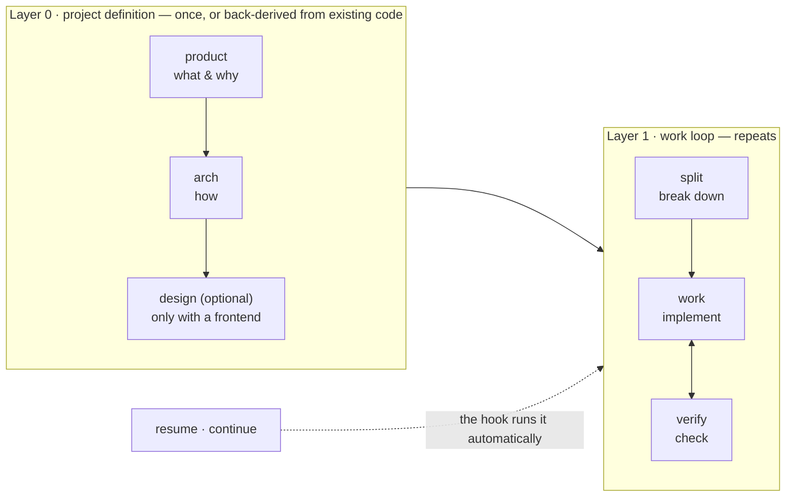
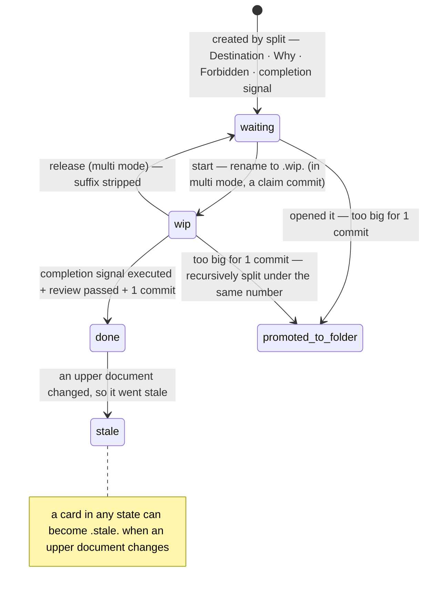
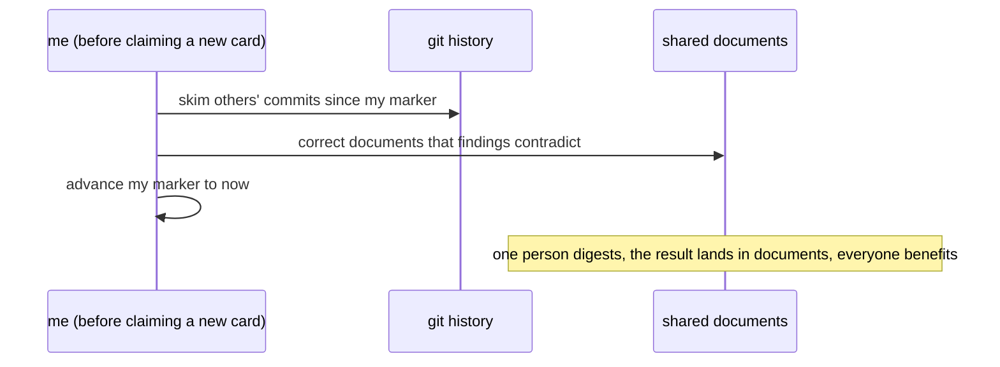

# devflow

> A development flow for AI sessions, connecting planning → implementation → verification. Supports Claude Code · Codex CLI.

[한국어](README_ko.md) · **English**

Every AI session starts with its memory wiped. devflow accumulates that memory **on disk,
not in conversation** — documents answer what you are building, the file tree answers how
far you have come, and the records answer why it was decided that way. Whenever a session
dies, the next one reads the files and picks up where it left off.

## The flow



| Situation | Entry point |
|---|---|
| New project | product, then in order |
| Adopting in an existing project | arch (back-derive from code) → split |
| Adding or extending features | split |
| Continuing in a new session | automatic (SessionStart hook — see the install sections), or resume |
| A teammate joins | make a room — see "Using it in a team" below |

## What accumulates in your project

Using devflow creates a single `devflow/` folder in the target project, and documents
accumulate hierarchically inside it:

```
devflow/
  project/                     ← Layer 0 output — upper documents that rarely change
    product.md                    what & why (capability list · success criteria)
    arch.md                       how (stack · structure · Provisional values · verify channel)
    design.md  code-style.md      (optional) design · code taste declarations
    glossary.md  decisions/       glossary · ADRs
  tree/                        ← canonical progress state — the filename IS the state
    01-foundation/                foundation (shared groundwork)
    02-payment/                   one capability = one folder
      02.1-model.done.md            a completed card
      02.2-api.wip.md               a card in progress (its progress log lives inside)
      02.3-webhook.md               a waiting card
      verify.md                     capability verification record (left by verify)
  journal.md                   ← one-line decisions that cross cards (swept when a capability closes)
  HANDOFF.md                   ← volatile handoff — traps · learnings · open decisions only, overwritten each time
```

**The life of a task card:**



The tree is recursive — a big card is promoted to a folder with the same number and keeps
splitting (`02.3` → `02.3.1`). Why progress never goes into documents: **progress written
into a document always goes stale, but a filename changes only when the state changes.**
One `ls` is the progress report.

When every card in a **depth-1 capability folder** is `.done.`, verify checks it by
actually running it, and only a pass earns the folder its `.done` (foundation 01 and
intermediate folders close without a verification rite). At that moment the journal is
swept — spent lines deleted, still-valid lines promoted into upper documents or left in
place. Measured values already replaced arch's Provisional table during work's
upper-document feedback step; verify confirms the replacement — **a stale document never
beats a measurement.**

## The 8 skills

| Skill | When | Produces | Design intent |
|---|---|---|---|
| product | new project | product.md · glossary.md | the capability names chosen here carry through as module and folder names, one word to the end |
| arch | after product, or back-derived from existing code | arch.md · code-style.md | separates guesses (Provisional) from decisions at the sentence level, so documents cannot lie |
| design | only with a frontend (optional) | design.md · token file · /preview | the canon for colors and spacing is a token file, not a document |
| split | breaking down work | capability folders · task cards in tree/ + the execution proposal (order · parallelism · model tiers — a user approval gate) | opens one layer at a time — earlier implementation reshapes later decomposition |
| work | implementation | code · in-card progress log · commits | log to disk before running — whenever the session dies, reading the card is enough to continue |
| verify | capability complete · MVP reached | verify.md · fix cards (on failure) | what was not executed is not passed — it is unverified |
| resume | new session | nothing — a state report, then approval (only multi mode's digest procedure corrects shared documents) | when HANDOFF and the tree conflict, the tree wins |
| principles | read before running by the six skills product–verify | — | the canonical rules live in exactly one place |

Two agents ride along (Claude only — not part of the Codex install): **reviewer** judges
before each commit by reading only the card (progress log excluded), the diff, and
code-style.md (never runs). **verifier** judges by running alone, knowing nothing of the
implementation history (never reads). Neither crossing into the other's territory is the
bias-prevention device.

## Design principles

- **Progress state lives in the file tree, not in documents.** Suffixes (`.wip.` `.done.` `.stale.`) and location are canonical.
- **The task card is the whole briefing.** Destination · Why · Forbidden · completion signal, on one card.
- **What was not executed is not passed — it is unverified.**
- **1 task = 1 commit.** Only after the completion signal and review pass. Rollback = one revert.
- **Measured answers flow back into documents (upper-document feedback).** Guesses live in the Provisional table and are replaced once measured.
- **Handoff carries crumbs only.** The tree answers where, the progress log answers how —
  HANDOFF keeps only traps · learnings · open decisions, and an empty file is normal.

The full "why" (decision table · rejection lineage) is in [docs/design.md](docs/design.md).
**To overturn a decision, refute its recorded reason first.**

## Using it in a team — two modes

devflow decides its mode **by file existence** (no settings, no flags):

```
any devflow/users/*/owner.md exists  →  multi mode
none exists                          →  solo mode (all multi rules are ignored)
```

**Solo mode** is the default. It is exactly what was described above — nothing new to learn.

**Multi mode** is for several people sharing one repository. Premise: not everyone on the
team needs devflow — adopters must not collide with each other, and non-adopters' work
must still be caught up on. The split axis is not people but the **scope of truth**:

```
devflow/
  project/  tree/  journal.md   ← shared truth — one service, one set of documents
  users/<id>/                   ← personal room — owner.md (identity) · HANDOFF.md (my handoff) · digest.md (marker)
```

The four key concepts:

- **claim** — the commit that renames a card to `.wip-<my id>.`. From then on the card is
  mine; others' claimed cards are read-only. On completion it becomes a bare `.done.`
  (git remembers ownership).
- **room** — where my session state lives. Everyone writes only in their own room; every
  room is readable by the whole team. The marker (digest.md) is the commit position that
  says "caught up to here".
- **digest** — the procedure for catching up on others' commits (including teammates who
  do not use devflow):



- **binding decision** — a decision that affects shared documents, tree structure, or
  someone else's card. Never shipped inside feature work — it lands immediately on the
  integration branch (the multi-only branch designated in arch's settings).

Only two habits are added to daily work: **pull and digest** before claiming a new card,
and claim via a **rename commit**. Everything else is the same as solo.

Every mode transition is a single-commit procedure:

| Transition | Procedure |
|---|---|
| Teammate joins | make a room (owner.md) + marker = current HEAD. Done |
| Solo → multi | create the room + move HANDOFF into it + `.wip.` → `.wip-<id>.` + marker = HEAD |
| Multi → solo | (the last person) HANDOFF moves back + delete users/ + restore suffixes + remove arch's multi-only config lines (integration · merge) |
| Teammate leaves | (after the user declares it) anyone remaining: promote open decisions to journal (attributed) → release their claims → delete the room |

Half-finished transitions (multi mode but a bare `.wip.` or a root HANDOFF remains)
are detected and reported by the hook and the integrity check — nothing goes wrong
silently. Sessions find their room via git identity; sessions that cannot resolve one
(CI · bots) only read.

owner.md is two lines:

```
id: jmp
git: "Jaemin Park", jmp@example.com
```

## Install — Claude Code

```
/plugin marketplace add nanomia/devflow
/plugin install devflow@nanomia
```

(Before the GitHub release, point marketplace add at a local clone path instead.)

Installs 8 skills + 2 agents + the SessionStart hook. Commands take the `/devflow:product`
form — the plugin name is the namespace, so collisions are blocked at the source, and
typing just `/devflow` groups the whole set in autocompletion. The hook activates only in
projects that have `devflow/tree/`, and injects tree state and HANDOFF at session start,
resume, and right after context compaction (which is why resuming works without typing
resume).

> Why there is only one hook: the covenant of writing the progress log to disk at every
> step makes PreCompact protection unnecessary, and a Stop hook fires every turn — noise.
> SessionStart alone covers it.

## Install — Codex CLI

```powershell
# Windows
powershell -File codex/install.ps1
```
```sh
# macOS/Linux
sh codex/install.sh
```

Creates the 7 `/devflow-*` commands in `~/.codex/prompts/` and registers the native Codex
SessionStart hook — the same `scripts/session-start.js` serves both Claude and Codex.
Prerequisite: `[features] hooks = true` in `~/.codex/config.toml` (the installer checks
and explains if missing). The canonical rules are embedded in each prompt (the Codex
prompt folder is flat, so cross-file references are unreliable). Only in hook-incapable
environments, add the `codex/AGENTS-devflow.md` block to the project's `AGENTS.md` as a
fallback.

**After editing any skill, run the installer again** (prompts are build artifacts).

## Other agents (Cursor, Copilot, opencode, …)

The `skills/<name>/SKILL.md` structure is the standard format of the
[skills.sh](https://skills.sh) CLI, so one `npx skills add <owner>/<repo>` installs into
20+ agents. This is also why the canonical rules live inside skills/ (the principles
skill) — even installers that copy only the skills folder carry the canon along.

## Further reading

- [docs/design.md](docs/design.md) — design philosophy · key decisions and reasons · rejection lineage
- [CHANGELOG.md](CHANGELOG.md) — per-version change history
- [AGENTS.md](AGENTS.md) — the maintenance gate for people and AI modifying this
  repository (dual-language workflow: Korean `*_ko.md` files are the design originals,
  English is the deploy artifact)

License: [MIT](LICENSE)
