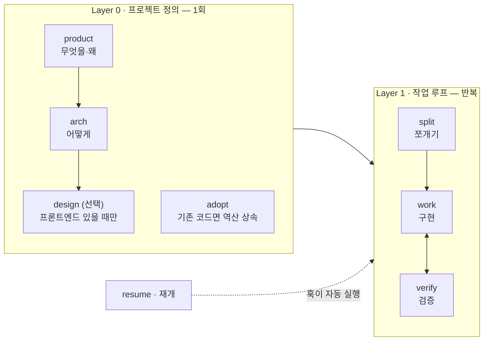
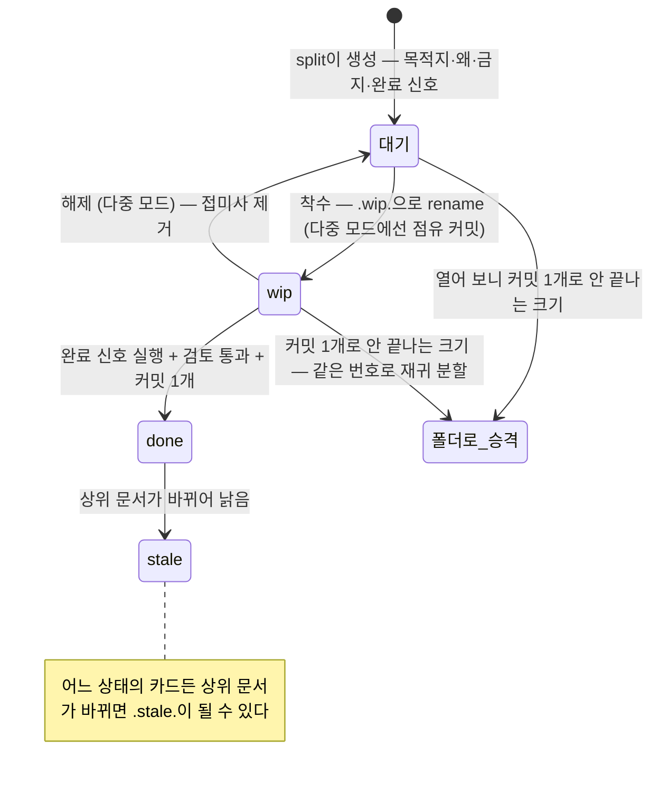
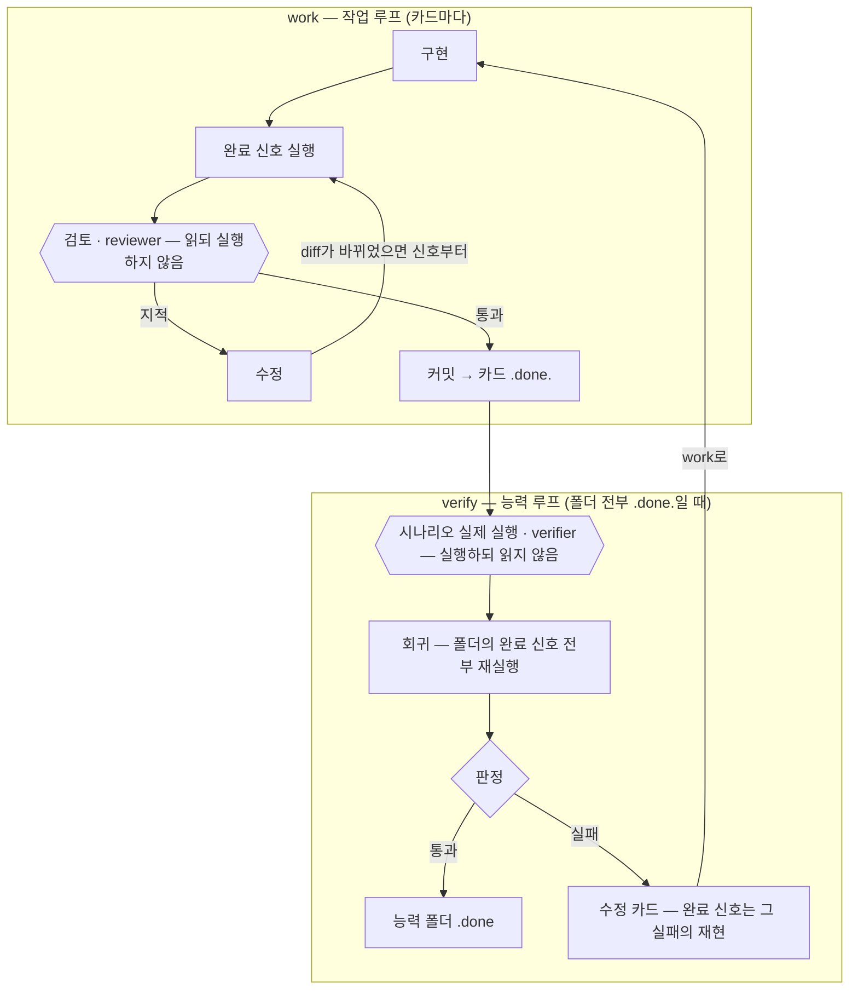
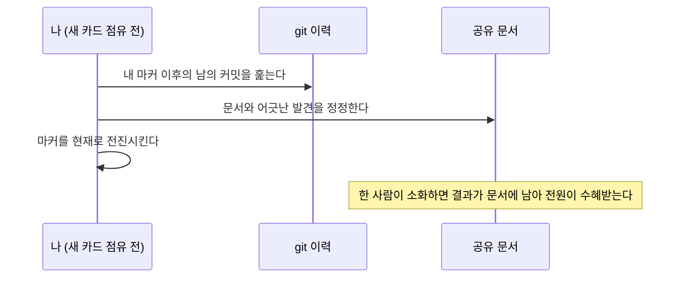

# devflow

> 기획 → 구현 → 검증을 잇는, AI 세션을 위한 개발 흐름. Claude Code · Codex CLI 지원.

**한국어** · [English](README.md)

AI 세션은 매번 기억을 잃고 시작한다. devflow는 그 기억을 **대화가 아니라 디스크에**
쌓는다 — 무엇을 만드는지는 문서가, 어디까지 왔는지는 파일 트리가, 왜 그렇게 정했는지는
기록이 답한다. 어느 세션이 언제 죽어도, 다음 세션은 파일만 읽고 이어받는다.

## 접근 — 방향은 풍부하게, 하네스는 최소로

최신 상위 모델은 구현 방법을 이미 안다. 절차를 촘촘히 지시할수록 모델은 판단을
멈추고 절차를 따른다. devflow는 반대로 간다: 무엇이 참이 되어야 하는지(목적지),
무엇을 하면 안 되는지(금지 — 3줄 이하), 끝났음을 무엇으로 아는지(실행 가능한 완료
신호)만 분명히 하고, **방법은 지시하지 않는다.** 모델의 성능을 가로막지 않으면서
의도한 방향으로만 흐르게 하는 최소한의 장치다.

| 분명히 하는 것 | 모델에 맡기는 것 |
|---|---|
| 목적지 — 무엇이 참이 되어야 하는가 | 구현 방법과 코드 패턴 |
| 금지 — 3줄 이하 | 도구와 경로의 선택 |
| 완료 신호 — 실행 가능한 확인 | 문제 풀이의 순서 |
| 좌표·정체성 — 지금 무엇의 일부인가 | 판단이 필요한 모든 지점 |

위 배분은 T-중(표준) 등급 이상 기준이다 — 하네스는 모델 등급에 반비례해서, 하위
등급에 맡기는 카드일수록 읽을 것과 순서 힌트, 금지가 늘어난다.

가볍다고 체계가 없는 것이 아니다. 진행 상태는 문서가 아니라 파일명이 기억하고,
검토와 검증은 구현 과정을 모르는 독립 컨텍스트가 맡으며, 실행하지 않은 것은
통과가 아니라 미검증이다. 같은 실패를 같은 방식으로 반복하지도 않는다 — 실패한
프롬프트는 그대로 재투입되지 않고(3회면 사람을 부른다), 검증을 빠져나간 결함은
그 실패를 재현하는 완료 신호가 되어 이후의 회귀가 계속 재실행한다. 그러면서도 하네스는
상상한 위험이 아니라 **실제로 겪은 결함이 있을 때만** 한 단계 자란다. 무겁지 않게
돌면서도, 겪은 실패가 다시 새지 않는 구조 — 이것이 devflow의 균형점이다.

## 흐름



| 상황 | 진입점 |
|---|---|
| 새 프로젝트 | product 부터 순서대로 |
| 기존 프로젝트에 도입 | adopt (코드에서 역산) → split |
| 기능 추가·고도화 | split |
| 새 세션에서 이어하기 | 자동 (SessionStart 훅 — 설치 절 참조) 또는 resume |
| 팀원 합류 | 방 만들기 — 아래 "팀에서 쓸 때" |

### 첫 걸음 — 새로 시작 vs 기존 코드에 도입

**새 프로젝트**는 인터뷰로 시작한다: product가 문제·능력·성공 판정을 묻고(질문은
묶음으로, 모든 질문에 기본값이 붙는다), arch가 스택·구조·검증 창구를 결정하고,
split이 첫 능력을 카드로 쪼개면 work ⇄ verify 루프에 들어간다.

**이미 코드가 있는 프로젝트**는 인터뷰 대신 역산으로 시작한다: adopt가 대표 흐름
하나를 코드에서 끝까지 추적한 뒤 product.md·arch.md·code-style.md를 역산 생성한다 —
product.md는 product 스킬과 같은 형식으로 채우되, 코드가 답할 수 없는 것(안 만들 것 ·
성공 판정 · 문제와 해결 방식의 빈 곳)만 소유자에게 묻는다. 이미 완성된 코드는 트리에 소급 기록하지 않는다 —
트리는 도입 이후의 작업부터 쌓인다. 이후는 같다: split → work ⇄ verify.

## 프로젝트에 무엇이 쌓이나

devflow를 쓰면 대상 프로젝트에 `devflow/` 폴더 하나가 생기고, 그 안에서 문서가
계층적으로 축적된다:

```
devflow/
  project/                     ← Layer 0의 산출 — 자주 안 바뀌는 상위 문서
    product.md                    무엇을 왜 만드나 (능력 목록·성공 판정)
    arch.md                       어떻게 만드나 (스택·구조·잠정값·검증 창구)
    design.md  code-style.md      (선택) 디자인 · 코드 취향 선언
    glossary.md  decisions/       용어집 · ADR
  tree/                        ← 진행 상태의 정본 — 파일명이 곧 상태
    01-foundation/                골조 (공용 토대)
    02-payment/                   능력 하나 = 폴더 하나
      02.1-model.done.md            완료된 카드
      02.2-api.wip.md               진행 중인 카드 (진행 로그가 안에 산다)
      02.3-webhook.md               대기 카드
      verify.md                     능력 검증 기록 (verify가 남긴다)
  journal.md                   ← 카드를 가로지르는 결정 한 줄씩 (능력이 닫힐 때 정리)
  HANDOFF.md                   ← 휘발성 인계 — 함정·배운 것·열린 결정만, 매번 덮어씀
```

**작업 카드 한 장의 일생:**



트리는 재귀다 — 큰 카드는 같은 번호의 폴더로 승격되어 계속 쪼개진다(`02.3` → `02.3.1`).
진행률을 문서에 적지 않는 이유: **문서에 적힌 진행률은 반드시 낡지만, 파일명은 상태가
바뀔 때만 바뀐다.** `ls` 한 번이 곧 진행 보고서다.

**1층 능력 폴더**의 카드가 전부 `.done.`이 되면 verify가 실제 실행으로 검증하고,
통과해야만 폴더에 `.done`이 붙는다 (골조 01과 중간 폴더는 검증 의식 없이 닫힌다).
그 순간 journal이 정리된다 — 효력이 끝난 줄은 삭제, 유효한 줄은 상위 문서로 승격하거나
남긴다. 실측된 값은 work의 환류 단계에서 이미 arch의 잠정값 표를 교체했고, verify는
그 교체를 확인한다 — **낡은 문서가 실측을 이기는 일이 없다.**

## 스킬 9개

| 스킬 | 언제 | 만드는 것 | 설계 의도 |
|---|---|---|---|
| product | 새 프로젝트 | product.md · glossary.md | 여기서 정한 능력 이름이 모듈명·폴더명으로 끝까지 같은 단어로 이어진다 |
| arch | product 후 | arch.md · code-style.md | 추측(잠정값)과 결정을 문장 차원에서 분리해 문서가 거짓말하지 못하게 한다 |
| adopt | 기존 코드에 도입 | product.md · arch.md · code-style.md (역산) | 인터뷰 대신 역산 — 코드가 답하는 것은 묻지 않고, 코드가 답 못 하는 것만 소유자에게 묻는다 |
| design | 프론트엔드 있을 때만 (선택) | design.md · 토큰 파일 · /preview | 색·간격의 정본은 문서가 아니라 토큰 파일 하나다 |
| split | 작업 쪼개기 | tree/의 능력 폴더·작업 카드 + 실행 제안(순서·병렬·모델 등급 — 사용자 승인 게이트) | 한 번에 한 층만 연다 — 앞선 구현이 뒤의 분해를 바꾼다 |
| work | 구현 | 코드 · 카드 안 진행 로그 · 커밋 | 실행 전에 로그를 디스크에 — 세션이 언제 죽어도 카드만 읽으면 이어진다 |
| verify | 능력 완료 · MVP 도달 | verify.md · (실패 시) 수정 카드 | 실행하지 않은 것은 통과가 아니라 미검증이다 |
| resume | 새 세션 | 없음 — 상태 보고 후 승인 (다중 모드의 소화 절차만 공유 문서를 정정한다) | HANDOFF와 트리가 충돌하면 트리가 이긴다 |
| principles | product–verify·adopt 일곱 스킬이 실행 전에 읽는다 | — | 규칙의 정본은 한 곳에만 산다 |

역할 2개가 동행한다: **reviewer**는 커밋 전에 카드(진행 로그는 제외)·diff·
code-style.md만 읽고 판정한다(실행하지 않음). **verifier**는 구현 이력을 모른 채
실행만으로 판정한다(읽지 않음). 서로의 영역을 침범하지 않는 것이 편향을 막는
장치다. 두 역할의 조건은 스킬 옆의 파일 하나씩이다(`skills/work/reviewer.md` ·
`skills/verify/verifier.md`) — 어느 플랫폼에서든 깨끗한 서브에이전트/새 세션에
그 파일을 원문 그대로 브리핑해 수행하므로 **처리가 같고**, Codex 설치는 이를
프롬프트에 동봉한다.

### work ⇄ verify — 안쪽 루프와 바깥 루프



같은 자리를 도는 루프는 없다 — 반복하려면 반드시 무언가를 먼저 바꾸고, 돌 때마다
무언가를 남긴다:

| 루프가 도는 곳 | 반복 전에 바뀌는 것 | 반복이 남기는 것 |
|---|---|---|
| 완료 신호 실패 | 1회: 카드 보강 → 2회: 등급 상승 또는 메인 직접 → 3회: 사람. 같은 프롬프트 재투입 금지 (실패 사다리) | 진행 로그의 시도와 원인 |
| 검토 지적 | 수정 + 완료 신호 재실행 — 바뀐 코드에 대해 이전 통과는 미검증 | 재검토를 통과한 diff |
| 능력 검증 실패 | 수정 카드 — 완료 신호가 그 실패를 재현한다 | 회귀에 영구 편입되는 신호 |
| 잠정값의 실측 | 상위 문서의 그 행을 교체한다 (환류) | 문서가 기억하는 측정값 |

유도하는 결과: **한 번 겪은 결함은 같은 문을 두 번 빠져나가지 못한다.**

## 설계 원칙

- **진행 상태는 문서가 아니라 파일 트리다.** 접미사(`.wip.` `.done.` `.stale.`)와 위치가 정본.
- **작업 카드가 브리핑의 전부다.** 목적지·왜·금지·완료 신호가 카드 한 장에 담긴다.
- **실행하지 않은 것은 통과가 아니라 미검증이다.**
- **1 작업 = 1 커밋.** 완료 신호·검토 통과 후에만. 되돌리기 = revert 하나.
- **측정된 답은 문서로 돌아간다(환류).** 추측은 잠정값 표에 살고, 실측되면 교체된다.
- **핸드오프는 부스러기만.** 위치는 트리가, 과정은 진행 로그가 답한다 — HANDOFF에는
  함정·배운 것·열린 결정만 남고, 다 비면 빈 파일이 정상이다.

왜 이렇게 설계했는지의 전문(결정 표·기각 계보)은 [docs/design_ko.md](docs/design_ko.md)에
있다. **결정을 뒤집으려면 기록된 이유부터 반박한다.**

## 팀에서 쓸 때 — 두 모드

devflow는 모드를 **파일 존재로 판별한다** (설정도 플래그도 없다):

```
devflow/users/*/owner.md 가 하나라도 있으면  →  다중 모드
하나도 없으면                              →  솔로 모드 (다중 규칙은 전부 무시됨)
```

**솔로 모드**가 기본이다. 지금까지 설명한 그대로이며 새로 배울 것이 없다.

**다중 모드**는 한 저장소를 여러 사람이 쓸 때다. 전제: 팀 전원이 devflow를 쓸 필요는
없다 — 쓰는 사람들끼리 충돌하지 않고, 안 쓰는 사람들의 작업도 따라잡는 구조다.
분할의 축은 사람이 아니라 **진실의 범위**다:

```
devflow/
  project/  tree/  journal.md   ← 공유 진실 — 서비스는 하나, 문서도 하나
  users/<id>/                   ← 개인 방 — owner.md(신원) · HANDOFF.md(내 인계) · digest.md(마커)
```

핵심 개념 네 가지:

- **점유(claim)** — 카드를 `.wip-<내 id>.`로 rename하는 커밋. 그때부터 그 카드는 내 것,
  남의 점유 카드는 읽기 전용. 완료되면 무기명 `.done.`이 된다 (소유는 git이 기억).
- **방(room)** — 내 세션 상태의 거처. 자기 방에만 쓰고, 방은 팀 전체가 읽는다.
  마커(digest.md)는 "여기까지 따라잡았다"를 가리키는 커밋 지점이다.
- **소화(digest)** — 남들(devflow를 안 쓰는 팀원 포함)의 커밋을 따라잡는 절차:



- **구속 결정(binding decision)** — 공유 문서·트리 구조·남의 카드에 영향을 주는 결정.
  기능 작업에 실어 보내지 않고 즉시 통합 브랜치(arch 설정에 지정된 다중 전용 브랜치)에
  착지시킨다.

일상에서 늘어나는 습관은 둘뿐이다: 새 카드를 점유하기 전에 **당겨오고 소화한다**,
점유는 **rename 커밋**으로 한다. 나머지는 솔로와 같다.

모드 전환은 전부 커밋 1개짜리 절차다:

| 전환 | 절차 |
|---|---|
| 팀원 합류 | 방 만들기(owner.md) + 마커 = 현재 HEAD. 끝 |
| 솔로 → 다중 | 방 생성 + HANDOFF를 방으로 이동 + `.wip.` → `.wip-<id>.` + 마커 = HEAD |
| 다중 → 솔로 | (마지막 1인) HANDOFF 복귀 + users/ 삭제 + 접미사 원복 + arch의 다중 전용 설정 줄(integration·merge) 제거 |
| 팀원 이탈 | (사용자 선언 후) 남은 누구든: 열린 결정을 journal로 승격(기명) → 그의 점유 해제 → 방 삭제 |

전환이 덜 끝난 상태(다중 모드인데 무기명 `.wip.`이나 루트 HANDOFF가 남음)는 훅과
정합성 점검이 감지해 알려준다 — 조용히 잘못되는 일은 없다. 세션은 git 신원으로 자기
방을 자동으로 찾고, 신원을 해석 못 하는 세션(CI·봇)은 읽기만 한다.

owner.md는 두 줄이다:

```
id: jmp
git: "Jaemin Park", jmp@example.com
```

## 설치 — Claude Code

```
/plugin marketplace add nanomia-ai/devflow
/plugin install devflow@nanomia
```

(GitHub 공개 전이라면 marketplace add에 로컬 클론 경로를 넣는다.)

스킬 9개(역할 조건 파일 동반) + SessionStart 훅이 설치된다. 명령은 `/devflow:product` 형식 —
플러그인 이름이 네임스페이스라 충돌이 원천 차단되고, `/devflow`까지만 쳐도 자동완성에
전체가 모여 보인다. 훅은 `devflow/tree/`가 있는 프로젝트에서만 동작하고, 세션 시작·
재개·컨텍스트 압축 직후에 트리 상태와 HANDOFF를 자동 주입한다 (그래서 resume을 안 쳐도
재개된다).

> 훅이 하나뿐인 이유: 진행 로그를 매 단계 디스크에 쓰는 규약 덕에 PreCompact 보호가
> 불필요하고, Stop 훅은 매 턴 발화라 소음이다. SessionStart 하나로 충분하다.

## 설치 — Codex CLI

```powershell
# Windows
powershell -File codex/install.ps1
```
```sh
# macOS/Linux
sh codex/install.sh
```

설치기가 세 채널을 한 번에 구성한다: ① **네이티브 플러그인** — 저장소를 마켓플레이스로
등록하고 `devflow@nanomia`를 설치해, 스킬 9종이 frontmatter 그대로 모델에 보인다
(자동 호출 — Claude와 같은 방식). ② `~/.codex/prompts/`의 `/devflow-*` 명령 8개 —
명시 호출 채널. 규칙 정본과 동반 문서가 각 프롬프트에 동봉된다(프롬프트 폴더는
평면이라 파일 간 참조가 불안정하기 때문). ③ Codex 네이티브 SessionStart 훅 — 같은
`scripts/session-start.js`가 Claude와 Codex 양쪽을 서빙한다. 전제:
`~/.codex/config.toml`에 `[features] hooks = true` (설치기가 검사해서 없으면 안내).
훅을 못 쓰는 환경에서만 `codex/AGENTS-devflow.md` 블록을 프로젝트 `AGENTS.md`에
폴백으로 추가한다.

**스킬을 수정했으면 설치 스크립트를 다시 실행한다** (플러그인 스냅숏과 프롬프트는
생성물이다).

## 다른 에이전트 (Cursor, Copilot, opencode 등)

`skills/<이름>/SKILL.md` 구조는 [skills.sh](https://skills.sh) CLI의 표준 형식이라,
`npx skills add <owner>/<repo>` 한 번으로 20여 개 에이전트에 설치된다. 규칙 정본을
skills/ 안(principles 스킬)에 둔 것도 이 때문이다 — 스킬 폴더만 복사하는 설치기에서도
정본이 함께 이동한다.

## 더 읽기

- [docs/design_ko.md](docs/design_ko.md) — 설계 철학 · 주요 결정과 이유 · 기각 계보
- [CHANGELOG.md](CHANGELOG.md) — 버전별 변경 이력
- [AGENTS.md](AGENTS.md) — 이 저장소를 수정하려는 사람·AI를 위한 유지보수 게이트
  (이중 언어 워크플로: 한글 `*_ko.md`가 설계 원본, 영문이 배포 실물)

라이선스: [MIT](LICENSE)
