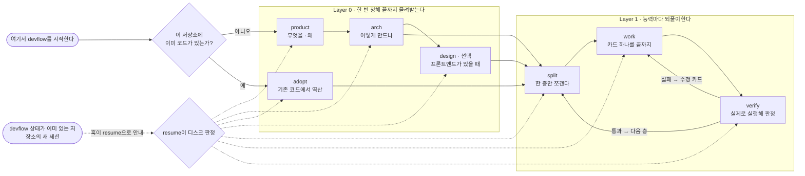
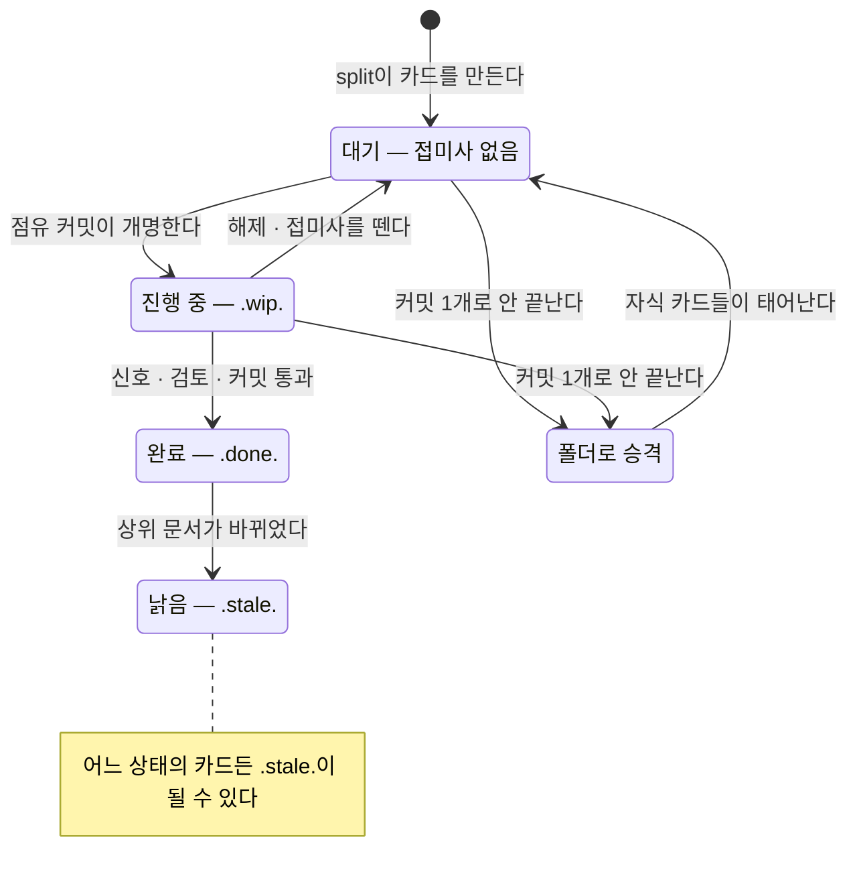
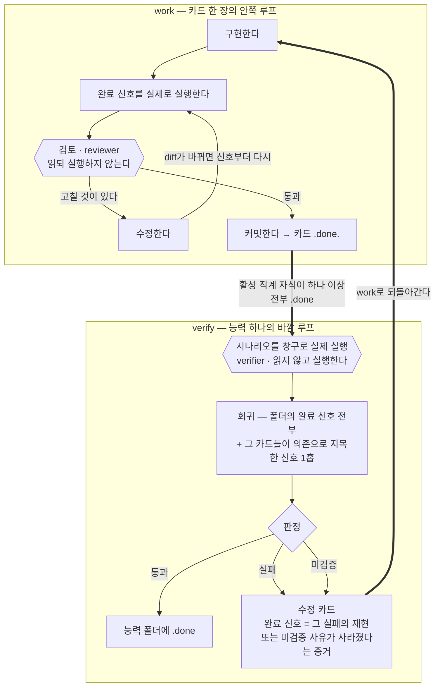
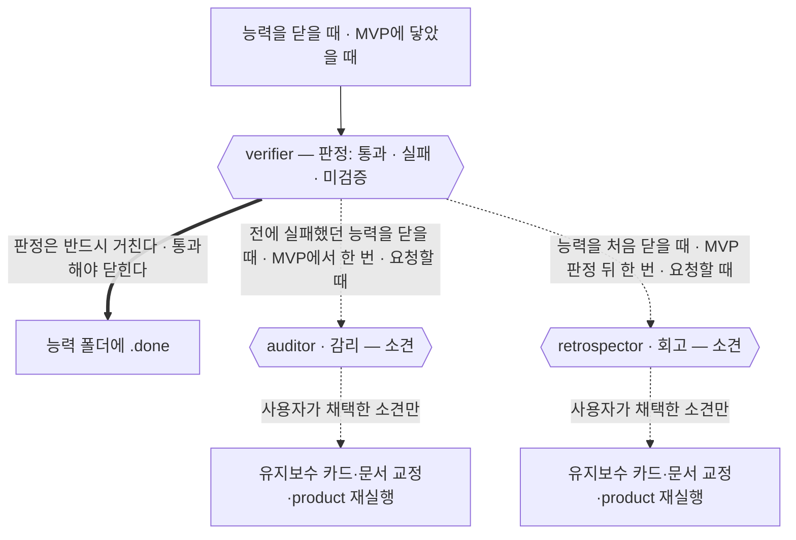
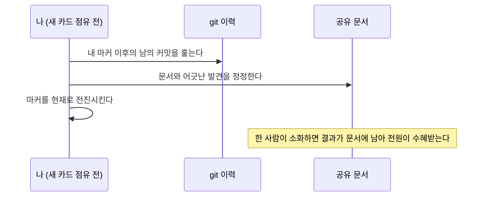

# devflow

> 기획 → 구현 → 검증을 잇는, AI 세션을 위한 개발 흐름. Claude Code · Codex CLI 지원.

**한국어** · [English](README.md)

AI 세션은 매번 기억을 잃고 시작한다. devflow는 그 기억을 대화가 아니라 디스크에 쌓는다.
무엇을 만드는지는 문서가, 어디까지 왔는지는 파일 트리가, 왜 그렇게 정했는지는 기록이
답한다. 어느 세션이 언제 죽어도, 다음 세션은 정해진 몇 개의 파일만 읽고 이어받는다.

## 접근 — 방향은 풍부하게, 하네스는 최소로

최신 상위 모델은 구현 방법을 이미 안다. 절차를 촘촘히 지시할수록 모델은 판단을
멈추고 절차를 따른다. devflow는 반대로 간다: 무엇이 참이 되어야 하는지(목적지),
무엇을 하면 안 되는지(금지 — 3줄 이하), 끝났음을 무엇으로 아는지(실행 가능한 완료
신호)만 분명히 하고, **방법은 지시하지 않는다.** 모델의 성능을 가로막지 않으면서 의도한
방향으로만 흐르게 하는, 최소한의 장치다.

| 분명히 하는 것 | 모델에 맡기는 것 |
|---|---|
| 목적지 — 무엇이 참이 되어야 하는가 | 구현 방법과 코드 패턴 |
| 금지 — 3줄 이하 | 도구와 경로의 선택 |
| 완료 신호 — 실행 가능한 확인 | 문제 풀이의 순서 |
| 좌표·정체성 — 지금 무엇의 일부인가 | 판단이 필요한 모든 지점 |

위 배분은 표준 등급(T-중) 이상 기준이다. 모델은 T-상/중/하 등급으로만 지칭하고, 실제
매핑은 split의 실행 제안에서 정한다. 하네스는 모델 등급에 반비례해서, 하위 등급에 맡기는
카드일수록 읽을 것과 순서 힌트, 금지가 늘어난다.

가볍다고 체계가 없는 것은 아니다. 검토와 검증은 구현 이력을 모르는 독립 컨텍스트가 맡고,
실행하지 않은 것은 통과가 아니라 미검증이며, 하네스는 상상한 위험이 아니라 실제로 겪은
결함이 있을 때만 한 단계 자란다. 루프가 어떻게 돌고 돌 때마다 무엇을 남기는지는 아래
work ⇄ verify 절이 표 하나로 보여준다.

## 흐름



| 상황 | 진입점 |
|---|---|
| 새 프로젝트 | product 부터 순서대로 |
| 기존 프로젝트에 도입 | adopt (코드에서 역산) → split |
| 기능 추가·고도화 | split |
| 새 세션에서 이어하기 | 자동 (SessionStart 훅 — 설치 절 참조) 또는 resume |
| 팀원 합류 | 방 만들기 — 아래 "방과 점유, 그리고 통합 브랜치" |

아직 아무것도 없는데 resume부터 실행했다면? resume이 질문 하나를 묻고 product 또는 adopt로
보낸다. 어디쯤인지 모르겠을 때의 안전망이기도 하다.

### 첫 걸음 — 새로 시작 vs 기존 코드에 도입

**새 프로젝트**는 인터뷰로 시작한다: product가 문제·능력·성공 판정을 묻고(질문은
묶음으로, 모든 질문에 기본값이 붙는다), arch가 스택·구조·검증 창구를 결정하고,
split이 세 번 돌고(능력 대기 파일 → `01-foundation/`과 직계 카드 → 첫 능력의 카드),
work ⇄ verify 루프는 그중 두 번째 뒤에 시작된다. 그래서 처음 구현하는 카드는 저장소 셋업과
검증 창구다.

**이미 코드가 있는 프로젝트**는 인터뷰 대신 역산으로 시작한다: adopt가 능력 후보를 먼저
열거하고 후보마다 대표 흐름 하나를 코드에서 끝까지 추적한 뒤
product.md·arch.md·code-style.md·glossary.md를 역산으로 만든다.
product.md는 product 스킬과 같은 형식으로 채우되, 코드가 답할 수 없는 것(안 만들 것,
성공 판정, 문제와 해결 방식의 빈 곳)만 소유자에게 묻는다. 성공 판정은 소유자가 답해야
하고 각 항목이 적힌 그대로 검증 가능해야 한다. 아니면 다시 묻고, 통과하기 전에는 arch
역산으로 넘어가지 않는다. 그 밖의 무응답만 열린 질문에 남긴다. 이미 완성된 코드는 트리에
소급해 적지 않는다. 트리는 도입 이후의 작업부터 쌓인다. 이후는 같다: split → work ⇄ verify.
기존 핸드오프·사양 문서는 복사하지 않는다. adopt가 `arch.md`에 능력별 정확한 경로만
색인하고, 변경 카드가 현재 코드와 다시 대조한 경로를 `읽을 것`에 적었을 때만 문서를 연다.
따라서 기존 기록 방식은 이어지지만 전역 읽기 비용이나 정본 지위는 얻지 않는다.
도입 후 추적한 변경이 끝나면 그 작업만 닫고 기다린다. 기존 서비스 전체의 제품층 검증은
사용자가 명시적으로 요청할 때만 연다.

### 아주 작은 변경 — 커밋이 곧 기록이다

버튼 문구 하나, 테두리 색 하나 같은 변경은 카드도 기록도 만들지 않는다. 세션이 세 가지를
확인하고 전부 아니면 바로 고친다. 사용자가 보는 동작이 바뀌는가, 설계 결정이 걸리는가, 다음
사람이 몰라서 틀릴 함정이 남는가. 아키텍처와 디자인 문서가 있으면 그것만 읽고, 고친 뒤 확인
한 번 돌리고, `tweak` 커밋 하나로 끝낸다. diff가 이미 완전한 기록이라 문서에 다시 적을 것이
없다. 셋 중 하나라도 걸리면 그 순간부터 보통 경로다 — 기록하고, 카드를 만들고, 승인을
받는다. devflow를 거치지 않고 직접 고쳐도 된다. 다음 세션의 소화가 그 커밋을 읽어 따라잡는다.

## 프로젝트에 무엇이 쌓이나

devflow를 쓰면 대상 프로젝트에 `devflow/` 폴더 하나가 생기고, 그 안에서 문서가
계층적으로 축적된다:

```
devflow/
  project/                     ← Layer 0의 산출 — 자주 안 바뀌는 상위 문서
    product.md                    무엇을 왜 만드나 (능력 목록·성공 판정)
    arch.md                       어떻게 만드나 (스택·구조·잠정값·검증 창구)
    design.md  code-style.md      (선택) 디자인 · 코드 취향 선언
    glossary.md  decisions/       용어집 · ADR
    capabilities/                 번호로 찾는 능력 문서 — 설계 구역 + 검증 구역
      01-foundation.md              골조의 공유 경계
      02-payment.md                 결제 능력의 현재 도메인 입구
  tree/                        ← 진행 상태의 정본 — 파일명이 곧 상태
    01-foundation/                골조 (공용 토대)
    02-payment/                   능력 하나 = 폴더 하나
      02.1-model.done.md            완료된 카드
      02.2-api.wip-jmp.md           jmp가 점유한 진행 중인 카드 (진행 로그가 안에 산다)
      02.3-webhook.md               대기 카드
      verify.md                     능력 검증 기록 (verify가 남긴다)
    03-reporting.md               아직 열지 않은 능력의 제목 한 줄짜리 대기 파일
  journal.md                   ← 작업 간 결정과 사람이 결정할 열린 항목 한 줄씩 + 규칙 정본이 정한 고정 형식 상태 줄 (정리되는 것은 결정뿐)
  users/<id>/                  ← 내 방 — owner.md(신원) · digest.md(마커) · HANDOFF.md(다음 한 걸음, 매번 덮어씀)
```

새 프로젝트의 첫 트리는 능력 대기 파일만 만든다. 다음 층에서 `01-foundation/`과 직계
카드를 함께 만들어, 빈 폴더가 완료된 골조처럼 남는 상태를 허용하지 않는다.

**작업 카드 한 장의 일생:**



트리는 재귀다. 큰 카드는 같은 번호의 폴더로 승격되어 계속 쪼개진다(`02.3` → `02.3.1`).
집계 진행률을 기획 문서에 적지 않는 이유는 간단하다. **기획 문서의 진행률은 반드시 낡지만,
파일명은 상태가 바뀔 때만 바뀐다.** 작업 안의 상세 진행은 그 카드의 진행 로그에만 남고,
`ls` 한 번이 전체 진행 보고서다.

1층 능력 폴더에 `.stale.` 아닌 직계 자식이 하나 이상 있고 그 자식이 모두 `.done` 상태이면
verify가 실제로 실행해 검증하고, 통과해야만
폴더에 `.done`이 붙는다(골조 01과 중간 폴더는 검증 없이 닫힌다). 그때 journal도 한 번
정리한다. 갱신할 문서가 정해진 작업 간 결정은 그 문서를 소유한 스킬로 라우팅되고, 그
스킬이 문서 갱신과 원본 줄 삭제를 한 커밋에 함께 착지시킨다. 나머지 줄은 그대로 남는다.
`.stale.` 카드는 이 계산에서 빠지지만 회고가 읽을 역사로 남는다.

무엇이 어디에 적히고 누가 읽는지는 한 표로 정리된다:

| 경로 | 쓰는 쪽 | 읽는 쪽 | 언제 바뀌나 |
|---|---|---|---|
| `project/product.md` | product (브라운필드는 adopt가 역산) | 모든 스킬, 정체성 문단으로 모든 카드 | product 인터뷰, 또는 발견→갱신 표 |
| `project/arch.md` | arch (브라운필드는 adopt가 역산하고 `기존 기록`·`브라운필드`를 소유) | split · work · verify · resume · design · adopt | arch 실행, 또는 발견→갱신 표 |
| `project/code-style.md` | arch (브라운필드는 adopt가 역산) | work, reviewer, verify의 표준 게이트 | arch 실행, 또는 새 규약 결정 |
| `project/glossary.md` | product (브라운필드는 adopt가 역산) | work, reviewer, verify | 새 용어가 필요할 때 |
| `project/decisions/ADR-*.md` | arch | 카드가 지목한 work, retrospector | 구속 결정이 생기거나 승계될 때 |
| `project/design.md` | design | work, split, adopt | design 실행 |
| `project/capabilities/NN-*.md` | arch(브라운필드는 adopt)가 설계 구역, verify가 검증 구역 | 번호로 자동 도달하는 work · 도메인 질문의 resume · reviewer · retrospector · 사람 | Layer 0 확정 뒤 설계 구역, 능력이 통과해 닫힐 때 검증 구역을 각각 통째로 |
| `tree/**` 작업 카드 | split이 만들고 work이 진행 로그를 채운다 | split · work · verify · reviewer · resume | 계획·구현·상태 전환마다 |
| `tree/<능력>/verify.md` | verify | resume의 유계 투영, retrospector | 그 능력을 검증할 때마다 |
| `tree/verify.md` | verify, 제품층 | resume, retrospector | 제품 검증을 할 때마다 |
| `journal.md` | 모든 스킬 — 작업 간 결정과 고정 형식의 줄 | verify가 매 검증 전 분류, split · work · resume · reviewer · retrospector | 작업 간 결정과 전환 상태 |
| `users/<id>/HANDOFF.md` | work, 작업 경계에서 | resume, work | 경계마다 통째로 덮어쓴다 |
| `users/<id>/` | 그 사람 | 본인, 남은 신원 확인용으로 owner.md만 읽는다 | 합류·점유·이탈 |

devflow가 남기는 상태 파일은 이 표가 전부다. 코드와 저장소의 다른 문서는 그대로 프로젝트의
것이다.

트리를 여는 두 관문, split과 resume은 시작하자마자 15항목 정합성 점검을 돌린다.
중복된 번호, 닫힌 폴더 안에 살아 있는 카드, 어느 카드도 가리키지 못하는
의존, 형식이 깨진 journal 줄을 찾아 **보고만 하고 고치지는 않는다.** 잘못 짚은 자동 교정이
이상 자체보다 빠르게 오염을 퍼뜨리기 때문이다. 형식이 깨진 journal 줄이나 검증 기록은 한
걸음 더 나아가, 사용자가 교체안을 확인할 때까지 모든 트리 쓰기를 막는다.

## 인계 — 넘기는 시점은 사람이 고른다

세션은 언젠가 끝난다. 그 시점을 정하는 사람은 너다.

AI는 자기 컨텍스트가 얼마나 남았는지 볼 수 없다. 그래서 퍼센트에 건 규칙 대신, 세션은
자기가 볼 수 있는 사건에서만 신호를 보낸다. 새 능력 폴더를 열기 전, 긴 카드에 착수하기
전, 체크포인트 커밋을 찍을 때 다음 걸음이 얼마나 큰지 알려 준다. 잔량을 보는 것도,
"이제 넘기자"고 말하는 것도 사람 몫이다.

넘기라고 하면 그 자리에서 인계가 만들어진다. 순서는 정해져 있다. 이번 대화에서 확정된
결정 중 아직 문서에 안 들어간 것을 먼저 착지시키고(발견→갱신 표), 남는 휘발성만 HANDOFF에
적는다. 그리고 작업 중간이 아니라 **작업 경계에서만** 넘긴다. 절반 짠 코드와 절반만 맞는
설명을 떠넘기지 않으려는 것이다.

다음 세션은 훅의 안내를 받아 resume이 디스크 상태와 HANDOFF를 읽고 이어받는다. 훅 자체는
파일 내용이나 다음 단계를 판정하지 않는다. 이제 HANDOFF에는 둘만 담긴다 — 다음 한 걸음과 사람이
결정해야 할 것. 세션이 배운 나머지는 영속되는 자리로 간다.

### 카드가 배운 것은 어디로 가나

인계는 덮어쓰인다. 거기 얹어 둔 것은 한 세션만 지나면 사라진다는 뜻이었다. 이제 두 줄이 그것을
나르고, 둘 다 살아남는다.

- **승계 줄.** 카드는 마지막 커밋 직전에 자기 진행 로그에 한 줄을 쓴다 — 이 능력의 다음 카드를
  틀리게 만들 수 있는 사실이다. 대개는 `none`이다. 그 능력의 다음 카드가 이 줄들을 자동으로
  읽는데, 그 능력이 마지막으로 검증을 통과한 뒤에 쓰인 것만 읽으므로 양이 늘지 않는다. 검증을
  통과하면 그것들이 능력 문서로 접히고 집합은 다시 비워진다.
- **능력 관측.** 작업 중에 **다른** 능력에 대해 알게 된 것은 그 능력 번호를 달고 journal.md로
  간다. 그 능력의 다음 검증이 거둬 가면서 그 줄을 지운다.

04.5에서 찾은 함정이 04.7에 저절로 닿고, 고객관리를 고치다 결제에 대해 알게 된 것이 결제에 닿는다.

## 스킬 9개

| 스킬 | 언제 | 만드는 것 | 설계 의도 |
|---|---|---|---|
| product | 새 프로젝트 | product.md · glossary.md | 여기서 정한 능력 이름이 모듈명·폴더명으로 끝까지 같은 단어로 이어진다 |
| arch | product 후 | arch.md · code-style.md · 골조와 능력의 설계 구역 | 추측(잠정값)과 결정을 분리하고 첫 카드 전부터 도메인 경계를 남긴다 |
| adopt | 기존 코드에 도입 | product.md · arch.md · code-style.md · glossary.md · 능력 설계 구역 (역산) | 인터뷰 대신 역산 — 코드가 답하는 것은 묻지 않고, 코드가 답 못 하는 것만 소유자에게 묻는다 |
| design | 프론트엔드 있을 때만 (선택) | design.md · 토큰 파일 · /preview | 색·간격의 정본은 문서가 아니라 토큰 파일 하나다 |
| split | 작업 쪼개기 | tree/의 능력 폴더·작업 카드 + 실행 제안(순서·병렬·모델 등급 — 사용자 승인 게이트) | 한 번에 한 층만 연다 — 앞선 구현이 뒤의 분해를 바꾼다 |
| work | 구현 | 코드 · 카드 안 진행 로그 · 커밋 | 실행 전에 로그를 디스크에 — 세션이 언제 죽어도 카드만 읽으면 이어진다 |
| verify | 능력 완료 · MVP 도달 | verify.md · (실패 시) 수정 카드 · (사건 발동) 감리·회고 소견 · 능력 문서의 검증 구역 | 실행하지 않은 것은 통과가 아니라 미검증이다 |
| resume | 새 세션 · 도메인 진입 | 상태 보고와 승인 또는 번호로 고른 도메인 설명. 능력이 아닌 폴더도 가장 깊은 곳부터 닫는다 | HANDOFF와 트리가 충돌하면 트리가 이기고, 가설은 사실처럼 말하지 않는다 |
| principles | 나머지 여덟 스킬이 실행 전에 읽는다 | — | 규칙의 정본은 한 곳에만 산다 |

역할 넷이 동행한다. 서로의 영역을 침범하지 않는 것이 편향을 막는 장치다.

- **reviewer** — 작업 커밋 전에 카드(진행 로그 제외)·diff·코딩 규약과 그 능력의 설계 구역·신선도 투영을 읽고 판정한다. 실행하지 않는다. 검토를 면제할 수 있는 것은 사용자뿐이고, 코드 diff가 없는 조사 카드만 그 밖의 예외다.
- **verifier** — 구현 이력을 모른 채 창구 실행만으로 판정한다. 읽지 않는다.
- **auditor(감리)** — 읽고 실행하되 구현 이력을 모른다. 판정 없이 소견만 낸다. 사건이 있을 때만 돈다(아래 감리 문단).
- **retrospector(회고)** — devflow 산출물만 읽고 실행하지 않는다. 설계에 더 나은 선택지가 있었는지 소견으로만 평가한다. 역시 사건이 있을 때만 돈다(아래 회고 문단).

네 역할의 조건은 각각 스킬 옆의 계약 파일 하나다(`skills/work/reviewer.md`,
`skills/verify/verifier.md`, `skills/verify/auditor.md`, `skills/verify/retrospector.md`).
어느 플랫폼에서든 깨끗한 서브에이전트나 새 세션에 그 파일을 원문 그대로 브리핑해서
수행하므로 처리가 같다.

### work ⇄ verify — 안쪽 루프와 바깥 루프



같은 자리를 도는 루프는 없다. 다시 돌려면 무언가를 먼저 바꿔야 하고, 한 바퀴 돌 때마다
무언가가 남는다.

| 루프가 도는 곳 | 반복 전에 바뀌는 것 | 반복이 남기는 것 |
|---|---|---|
| 완료 신호 실패 | 1회: 카드 보강 → 2회: 등급 상승 또는 메인 직접 → 3회: 사람. 같은 프롬프트 재투입 금지 (실패 사다리) | 진행 로그의 시도와 원인 |
| 구현 중 같은 가설 반복 | 2회 실패면 멈춤 — 가설·반증 한 줄, 그대로면 조사 카드 또는 깨끗한 컨텍스트 진단 (고착 탈출) | 로그에 남은 가설과 반증 |
| 검토 지적 | 수정 + 완료 신호 재실행 — 바뀐 코드에 대해 이전 통과는 미검증 | 재검토를 통과한 diff |
| 능력 검증 실패 | 수정 카드 — 완료 신호가 그 실패를 재현한다 | 회귀에 영구 편입되는 신호 |
| 잠정값의 실측 | 상위 문서의 그 행을 교체한다 (환류) | 문서가 기억하는 측정값 |
| 감리 소견 채택 | 사용자 승인 — 채택된 소견만 카드가 된다 | 표본 밖 구멍의 발견, 그 수정의 회귀 편입 |
| 회고 소견 채택 | 사용자 승인 — 채택만 카드 또는 다시 세운 계획이 된다 | 설계 선택지의 재평가 기록 |

**감리는 검증이 구조적으로 못 보는 것을 찾는다.** 검증은 이 흐름이 스스로 쓴 시나리오와
신호, 성공 판정을 대조한다. 그래서 시나리오 밖의 구멍이나 스펙이 놓친 기대는 검증으로
드러나지 않는다. 감리는 그 둘을 사냥하려고 세 경우에만 돈다. MVP에 닿았을 때, 전에
검증에서 실패했던 능력을 닫을 때, 사용자가 요청할 때. auditor가 창구를 직접 실행해 보며
살피지만 판정은 내리지 않아서 통과를 막지 않고, 사용자가 채택한 소견만 카드가 된다.
한 번에 깨끗하게 닫힌 능력에는 감리가 붙지 않는다.

**회고는 설계 자체를 향해 한 번 묻는다.** 구현자도 검토자도 지금 설계를 전제로 일하니
"더 나은 선택지가 있지 않았나"는 아무도 묻지 않는다. 그래서 능력을 처음 닫을 때 그 능력
범위로 한 번, MVP에 닿으면 전체를 놓고 한 번 묻는다. 코드는 읽지 않는다. 수정 카드가
몰린 폴더, `.stale.` 카드, ADR에 붙은 갱신 주석처럼 프로젝트가 남긴 흔적만 본다. 소견은
구체적인 대안, 이 프로젝트에서 관측된 긴장 증거, 전환 비용 추정(추정이라고 표시한다)
셋을 갖출 때만 성립하고, 채택 여부는 사용자가 정한다.

무언가를 닫는 자리에는 세 겹이 선다. 판정은 반드시 거치고, 소견은 사건이 있을 때만
붙으며, 점선은 아무것도 막지 않는다. 판정이 통과여도 폴더가 곧바로 닫히지는 않는다.
능력의 코드 범위를 code-style.md와 대조하고, 그 능력이 해소하기로 한 잠정값이 실제로
교체됐는지 확인한다. 둘 중 하나가 걸리면 `.done` 대신 수정 카드가 나온다.



유도하는 결과: **한 번 겪은 결함은 같은 문을 두 번 빠져나가지 못한다.**

## devflow가 멈추고 묻는 순간

나머지는 전부 AI가 판단한다. 아래 지점에서는 멈추고 사람을 기다린다.

- **실행 제안 승인** — split이 카드를 다 만든 뒤 순서·병렬·모델 등급을 제안한다. 승인은 각
  카드에 기록되고, 그 카드를 손으로 고치면 승인이 풀려 다시 묻는다.
- **검토 면제** — 카드의 `검토`를 `면제`로 바꿀 수 있는 것은 사용자뿐이다. AI는 스스로 면제하지
  않는다.
- **정합성 이상의 교정** — 점검은 깨진 줄을 고치지 않고 보고한다. 원본과 제안된 교체본을 함께
  보여주고, 사용자가 확인해야 한 줄이 바뀐다.
- **감리·회고 소견의 채택** — 소견은 판정이 아니다. 채택한 것만 카드가 되고, 거절한 것은 개수만
  남는다.
- **재개 보고의 승인** — resume은 상태를 한 문단으로 보고하고 승인 전에는 코드를 고치지 않는다.
- **Layer 0 문서의 확정** — product·arch·design·adopt가 만든 문서는 사용자가 확정한 직후에만
  커밋된다.
- **확정 문장의 반증** — 측정이 확정된 정체성 문단이나 성공 판정을 무너뜨려도, 사용자 확인 없이는
  그 문장을 바꾸지 않는다.
- **능력이 둘로 보일 때** — 설계·검증 구역이 약 185줄 계약 안에서 현재 구조를 표현하지 못하면
  이유와 초과 절을 보고한다. 나눌지 말지는 사용자가 정한다.
- **열려 있는 rebase·merge** — 어느 스킬이든 진입 즉시 멈추고 계속할지 중단할지 묻는다. 스스로
  중단하는 일은 없다.

## 도메인에 들어갈 때 — 능력 지식 기준선

능력이란 제품이 할 수 있는 일 하나를 끝까지 말한 것이다. 화면과 API와 데이터가 한 덩어리다.
product.md가 그 이름을 정하고, 이후 모든 단계가 같은 단어를 그대로 쓴다.

능력 하나에 파일 하나가 있다. 경로는
`devflow/project/capabilities/NN-<이름>.md`다. **다음 세션도, 새로 합류한 사람도 이 한 장에서
도메인 안으로 들어온다.** 목적과 소유 경계, 개념, 불변식, 검증된 주 흐름과 현재 행위,
진입점, 소비 계약, 함정, 실제 검증 방법이 한곳에 있다.

파일은 처음부터 생긴다. 새 프로젝트는 product와 arch가 확정된 뒤 arch가 골조와 모든 비은퇴
능력의 설계 구역을 쓴다. 이미 코드가 있는 프로젝트는 adopt가 대표 흐름을 역산한 Layer 0에서
같은 구역을 쓴다. 0.10.x처럼 Layer 0만 있고 능력 문서가 없는 프로젝트는 resume이 이를 찾아
브라운필드면 adopt로, 새 프로젝트면 arch로 보내 그 문서만 쓰게 한다. 인터뷰나 코드 역산을
다시 하지 않는다. 프로젝트별 on/off 스위치는 없다.

한 파일 안의 생애는 둘이다.

- **설계 구역** — 첫 카드 전에 arch(브라운필드는 adopt)가 쓴다. 목적·경계·개념·불변식·하지
  않기로 한 것과 정확한 구속 ADR 경로를 담는다.
- **검증 구역** — `## Verified state`부터 끝까지다. 능력이 실제 검증을 통과할 때 verify가 현재
  코드에서 다시 써 준다.

두 구역은 서로의 문장을 고치지 않는다. 각 구역 안에 자기 신선도 도장이 있고, 입력이 바뀌면
그 구역만 가설로 내려간다. 가설은 삭제나 실패가 아니다. AI가 현재 권위에서 다시 확인해야
한다는 표지다. 기준선 자체는 정본이 아니어서 충돌하면 현재 코드와 Layer 0·ADR이 이긴다.

작업에는 카드 배선 없이 들어온다. work은 점유 카드의 깊이 1 폴더 번호로 능력 문서를 찾고,
골조 카드면 `01-foundation.md`를 찾는다. 조사 카드도 예외가 없다. 구속 ADR은 문서가 열거한
정확 경로만 함께 읽는다. 그래서 카드마다 기준선 경로를 복제하거나 사용자가 붙여 줄 필요가
없다. v0.10 카드의 `읽을 것`에 남은 능력 문서 경로도 구형 배선으로만 보고 번호 자동 진입으로
넘긴다. 정확한 v0.10 기준선 파일이 이미 있으면 현재 Layer 0에서 설계 구역을 만들고, 옛 검증
본문·timestamp·범위·카드 집합은 내용 판단 없이 새 검증 구역으로 옮긴다. 손상 파일 초기화와
섞지 않는다. 옛 head는 소비 경로를 입력으로 삼지 않았으므로 승계하지 않고, 이관 직후 검증
구역은 그 능력이 다음 검증을 통과해 새 입력으로 갱신될 때까지 가설로 표시한다.

도메인을 먼저 이해하고 싶으면 자연어로 묻는다. 예를 들면 “결제 도메인 설명해 줘”, “05 능력에
들어가기 전에 알아야 할 것”, “골조의 공유 계약을 알려 줘”, “모든 도메인 경계만 보여 줘”다.
resume은 이름이나 번호로 한 파일을 고르고, 이름이 빠졌거나 모호하면 번호·이름 후보만 먼저
보여 준다. 기대 집합 전부를 명시적으로 요청한 경우에만 전체를 읽는다. 답에는 파일 경로와 두 구역의 신선도,
기준선 이후 완료 카드 집합에 들어오거나 빠진 항목이 함께 나온다. 가설인 검증 내용을 현재 사실처럼 설명하지 않는다.

도메인 관계는 소비하는 쪽에만 적는다. 정확한 계약 경로가 신선도 계산에 들어가고, 공급자 능력을
닫거나 나누거나 은퇴할 때 등록된 소비자와 각자의 현재 신선도를 한 줄로 보여 준다. 이것은
인지 장치다. 다른 능력의 검증을 자동 실행하거나 카드를 만들지는 않는다.

사람이 할 일은 작다. 처음에는 Layer 0를 먼저 확정하고, 이어서 arch·adopt가 만든 설계 구역
묶음을 한 번 확인한다. 이후에는
도메인에 들어갈 때 읽고, 틀렸다고 확인한 본문 행·항목은 절을 비우지 않는 범위에서 삭제할 수
있다. 마지막 항목이라면 작성 스킬이 절을 `None.`으로 치환하게 한다. 고정 제목·메타데이터는
건드리지 않고, 직접 삭제했다면 다음 devflow 스킬 전에 그 삭제만 단독 커밋한다. 추가와 재작성은
각 구역의 작성자에게 맡긴다. 능력이 은퇴해도 파일은 역사로 남고
보통 진입 목록에서만 빠진다.

## 설계 원칙

- **진행 상태는 문서가 아니라 파일에 있다.** 세 가지가 서로 다른 것을 맡는다. 작업이 어디까지
  왔는지는 접미사(`.wip.` `.done.` `.stale.`)와 위치가, 그 작업 안에서 무슨 일이 있었는지는 그
  카드의 진행 로그가, 중단된 전환이 어디서 멈췄는지는 규칙 정본이 형식을 고정한 journal·verify.md의
  상태 줄이 맡는다. 문서에는 여전히 진행률을 적지 않는다.
- **작업 카드가 작업 단위를 전부 정의한다.** 목적지·왜·금지·완료 신호는 카드 한 장에
  담고, 고정 공유 기록(product·arch·code-style·glossary·journal·있으면 design·직접 의존 카드)과
  카드의 `읽을 것`이 지목한 정확한 경로는 함께 읽는다.
- **실행하지 않은 것은 통과가 아니라 미검증이다.**
- **1 작업 = 1 커밋.** 완료 신호·검토 통과 후에만. 되돌리기 = revert 하나.
- **측정된 답은 문서로 돌아간다(환류).** 추측은 잠정값 표에 살고, 실측되면 교체된다.
- **핸드오프는 다음 걸음 하나만 담는다.** 위치는 트리가, 과정은 진행 로그가, 카드가 배운 것은
  그 카드의 승계 줄이 답한다. 사람이 결정할 열린 항목은 journal 한 줄로 남는다.

왜 이렇게 설계했는지의 전문(결정 표·기각 계보)은 [docs/design_ko.md](docs/design_ko.md)에
있다. **결정을 뒤집으려면 기록된 이유부터 반박한다.**

## 방과 점유, 그리고 통합 브랜치

devflow의 모드는 하나다. 터미널 하나로 혼자 쓰든 다섯 사람이 한 저장소를 쓰든 모든 세션은
자기 방에서 일한다. 켤 플래그도, 갈아탈 모드도 없다.

```
devflow/
  project/  tree/  journal.md   ← 공유 진실 — 서비스는 하나, 문서도 하나
  users/<id>/                   ← 개인 방 — owner.md(신원) · HANDOFF.md(다음 걸음) · digest.md(마커)
```

분할의 축은 사람이 아니라 **진실의 범위**다. 진실이 하나인 문서는 공유하고, 한 사람이
소유하는 것만 방에 둔다. 팀 전원이 devflow를 쓸 필요도 없다. 쓰는 사람들끼리 충돌하지 않고,
안 쓰는 사람들의 작업도 따라잡는 구조다.

핵심 개념 다섯 가지:

- **id** — 내가 누구인가. 세션이 git 이름과 이메일을 읽어 각 방의 owner.md와 대조한다.
  방이 없는 새 프로젝트에서는 id 후보를 제안하고, 확인받으면 그때 방을 만든다.
- **점유(claim)** — 카드를 `.wip-<내 id>.`로 rename하는 커밋. 그때부터 그 카드는 내 것,
  남의 점유 카드는 읽기 전용. 완료되면 무기명 `.done.`이 된다 (소유는 git이 기억).
- **통합 브랜치** — 발급·폐쇄·구속 결정이 착지하는 곳. arch.md의 `integration`이 지목한다.
  **혼자 쓰면 그 값이 지금 쓰는 브랜치**이고, 그러면 통합 절차가 전부 통상 커밋으로 줄어든다.
- **소화(digest)** — 내 세션 밖에서 생긴 커밋을 따라잡는 절차. 팀원의 커밋도, 내가 손으로
  고친 것도 여기서 걸린다:



- **구속 결정(binding decision)** — 공유 문서·트리 구조·남의 카드에 영향을 주는 결정.
  기능 작업에 실어 보내지 않고 즉시 통합 브랜치에 착지시킨다.

일상에서 늘어나는 습관은 셋이다: 새 카드를 점유하기 전에 **당겨오고 소화한다**, 점유는
**rename 커밋**으로 한다, 라우팅 전에 통합 브랜치에서 공유 상태를 읽는다(거기 활성 마커가
있으면 통합 팁을 현재 브랜치에 먼저 포함한다). 앞의 둘은 경계에서만 돌고, 셋째는 점유
중에도 돈다.

혼자 쓸 때 이 규칙들이 물리는 값은 **카드당 커밋 하나**, 점유 커밋뿐이다. 그 한 줄이
터미널 두 개나 워크트리 두 개가 서로의 진행 중인 작업을 보게 만든다.

**한 폴더에서 터미널을 몇 개 돌려도 안전하다.** 세션마다 자기 카드를 잡고 동시에 진행한다.
같은 능력 안의 카드들도 마찬가지다 — 두 번째 터미널이 카드를 잡는 데 절차도 질문도 없고,
이미 잡혀 있는 내 카드 목록을 한 줄 알려줄 뿐이다.
근거는 측정 셋이다. 커밋에 자기 경로를 지정하면 남이 미리 stage해 둔 파일이 섞이지 않는다.
네 세션이 동시에 기록장에 덧붙여도 한 줄도 잃지 않는다. 같은 소스 파일의 다른 부분을 각자
고치면 둘 다 살아남고, 같은 자리를 고치면 조용히 덮는 대신 시끄럽게 실패한다. 사람이 지킬
지침은 셋이다. 같은 카드를 두 터미널에 시키지 않는다 — 디스크는 터미널을 구분하지 못한다.
살아 있는 흐름이 또 있으면 파일을 통째로 다시 쓰게 하지 않는다. 영역이 겹치는 카드를 같은
시간에 배정하지 않는다 — 겹쳐도 조용히 덮이지는 않지만, 시끄러운 실패를 되풀이할 이유가 없다.

**워크트리는 안전이 아니라 빌드 격리를 산다.** 폴더를 나누면 각자 미커밋 파일을 갖게 되어
한쪽의 반쯤 짠 코드가 다른 쪽 테스트를 깨뜨리지 못한다. 공유 파일에 관해서는 한 폴더가 오히려
낫다. 나누면 충돌이 사라지는 것이 아니라 병합하는 사람에게 미뤄진다. 한 저장소의 워크트리들은
이력 저장고 하나를 공유하므로 한 폴더의 점유가 원격도 fetch도 없이 다른 폴더에서 보인다.

알아 둘 한계는 셋이다. Git은 한 워크트리가 다른 워크트리의 체크아웃 브랜치에 쓰는 것을 막으므로
통합 브랜치는 아무 폴더도 체크아웃하지 않은 채 두는 것이 낫다. 그러면 어느 폴더에서든 구속
결정을 착지시킬 수 있다. **팀이 main을 보호하고 PR로만 받는다면 통합을 보호받지 않는 브랜치로
두고 PR은 거기서 main으로 올린다** — 카드를 잡는 순간 착지해야 하는데 리뷰를 기다릴 수 없기
때문이다. 그리고 한 사람의 두 세션은 같은 id를 쓰므로 디스크가 둘을 구분하지 못한다 — 내
점유가 여럿인데 어느 카드인지 말하지 않으면 resume이 추측하지 않고 묻는다.

팀이라면 플러그인 버전을 맞춘다. 특히 0.12와 0.13은 공유 상태의 정의가 달라서, 섞이면
반쪽이 옛 규칙으로 판정한다. 바깥 오케스트레이터가 devflow 위에서 worker를 돌리는 것도
된다 — 순서 하나만 지키면 된다. worker를 띄우기 전에 통합 브랜치에서 카드와 점유를 먼저
만들고, worker는 코드와 진행 로그만 쓴다.

방 전환은 전부 커밋 1개짜리 절차다:

| 전환 | 절차 |
|---|---|
| 팀원 합류 | 방 만들기(owner.md) + 마커 = 현재 HEAD. 끝 |
| 0.12 이전 프로젝트에서 올라오기 | arch가 `integration`·`merge`를 더한다 → 신원 해결이 방을 만든다 → work이 `.wip.`을 `.wip-<id>.`로 바꾸고 HANDOFF를 방으로 옮긴다 |
| 팀원 이탈 | (사용자 선언 후) 남은 누구든: 그 방에 남은 구형 `열린 결정` 절을 journal로 옮김(기명) → 그의 점유 해제 → 방 삭제 |

올리다 만 상태(무기명 `.wip.`이나 루트 HANDOFF가 남음)도 위의 정합성 점검이 잡아내고,
resume이 work으로 되돌린다. 조용히 잘못되는 일은 없다. 세션은 git 신원으로 자기
방을 자동으로 찾고, 신원을 해석 못 하는 세션(CI·봇)은 읽기만 한다.

owner.md는 두 줄이다:

```
id: jmp
git: "Jaemin Park", jmp@example.com
```

## 설치

두 플랫폼 모두 이 저장소를 GitHub 주소로 등록하고 플러그인을 설치한다. 각각 두 줄이면
끝나고, 설치되는 내용도 같다. 스킬 9개, 역할 계약 4개, 판정 정본 동반 문서 3개,
그리고 SessionStart 훅이다.

### Claude Code

세션 안에서 두 줄이면 끝난다.

```
/plugin marketplace add nanomia-ai/devflow
/plugin install devflow@nanomia
```

명령은 `/devflow:product` 형식이다. 플러그인 이름이 네임스페이스라 다른 스킬과 충돌하지
않고, `/devflow`까지만 쳐도 자동완성에 전체가 모여 보인다. 훅은 `devflow/tree/` 또는
Layer 0 문서가 있는 프로젝트에서만 동작하며, 세션 시작·재개·컨텍스트 압축 직후에 공유
resume 절차를 실행하라고 안내한다. 파일 내용과 다음 단계 판정은 resume이 맡는다.

### Codex CLI

같은 두 줄이다. 스킬과 훅이 함께 설치된다.

```
codex plugin marketplace add nanomia-ai/devflow
codex plugin add devflow@nanomia
```

훅을 쓰려면 `~/.codex/config.toml`에 다음 한 줄이 필요하고, 첫 세션에서 Codex가 이 훅을
신뢰할지 한 번 묻는다.

```toml
[features]
hooks = true
```

스킬은 모델이 알아서 호출한다. 0.13.0 이전에는 `~/.codex/prompts/`에 `/devflow-*` 슬래시
명령 8개를 만드는 두 번째 채널이 있었지만 없앴다. 프롬프트마다 규칙집 전체를 동봉해야 했고,
규칙을 한 번 고칠 때마다 설치기 둘의 내장 로직까지 맞춰야 했다. 지금은 플러그인이 스킬과
동반 문서를 함께 배달하므로 `../principles/SKILL.md` 참조가 Claude에서와 똑같이 풀린다.
`codex/install.ps1`(Windows)이나 `codex/install.sh`(macOS/Linux)는 로컬 개발용으로 이 폴더를
마켓플레이스로 등록하고, devflow가 만든 프롬프트만 표식으로 가려 지운다 — 같은 이름으로 네가
직접 쓴 파일은 남긴다.

훅은 두 단계로 넘긴다. 훅을 신뢰할지는 설치기가 아니라 네 결정이기 때문이다. 설치는 0.9.20
이전 전역 등록을 그대로 살려 두고, `/hooks`에서 플러그인 항목을 직접 확인한 뒤 실행할 명령
한 줄을 찍어 준다.

설치 후 `codex plugin list`에 `devflow@nanomia`가 보이면 성공이다. 안 보인다면 Codex 설정에
**폴더가 사라진 다른 마켓플레이스**가 남아 있는 경우가 많다. 그런 항목 하나가
`codex plugin` 명령 전체를 실패시킨다. `config.toml`(`CODEX_HOME` 또는 `~/.codex`)에서 그
항목을 지우고 다시 시도한다. 다른 원인은 `CODEX_HOME`이다. 이 환경 변수가 다른 홈을
가리키면 설치가 그쪽으로 가고 `~/.codex`는 조용히 빈 채로 남는다. 설치기 첫 줄이
`Codex home:`을 찍으니 이번 실행이 어느 홈을 썼는지 거기서 확인한다.

> 훅이 하나뿐인 이유: 진행 로그를 매 단계 디스크에 쓰는 규약 덕에 PreCompact 보호가
> 불필요하고, Stop 훅은 매 턴 발화라 소음이다. SessionStart 하나로 충분하다.

## 보장하지 않는 것

경계를 아는 도구가 신뢰를 얻는다. 아래는 devflow가 막아 주지 않는 자리다.

| 상황 | 왜 |
|---|---|
| 두 세션이 같은 파일을 통째로 다시 씀 | 부분 수정끼리는 안전하고 통째 쓰기만 조용히 덮는다. 규칙 한 줄이 막지만 그 규칙을 어기는 것까지는 못 막는다 |
| 공유 쓰기 지점이 없는 두 clone에서 번호·점유 발급 | 서로 못 보면 둘 다 정당하게 같은 카드를 잡는다. 공유 ref·조정자·사전 배정 중 하나가 필요하다 |
| 카드가 앞으로 쓸 경로를 미리 아는 것 | `읽을 것`은 입력 집합이다. 새 파일과 구현 중 발견은 미래 정보다 |
| 사용자 확인 없이 훅을 신뢰시키는 것 | 신뢰 경계를 없애는 것이지 자동화가 아니다 |
| 같은 DB·포트·개발 서버를 쓰는 두 흐름의 완료 신호 | 파일 격리와 실행 환경 격리는 다르다. split은 공유 개발 서버를 건드리는 작업을 순차로 둔다 |
| 통합 밖에서 만든 상태의 전역 정합성 | 조정점이 없으면 전역 답이 없다 |
| 관리자가 통합 브랜치를 force-push로 다시 쓰는 것 | devflow 자신은 revert로만 되돌리지만, 저장소 밖의 손까지는 못 막는다. 지워진 점유는 카드를 대기로 되돌려 보이게 한다 |
| 라우팅과 계획을 작은 모델로 돌렸을 때의 판정 품질 | 카드에는 등급 체계가 있지만 세션 모델은 사용자 선택이다. 규칙 정본을 오독할 확률은 모델을 따라간다 |
| 작은 프로젝트에서의 비용 우위 | 세션당 카드 하나면 일반 개발의 약 2.6배다. 세션에 카드가 많을수록, 코드베이스가 클수록 뒤집힌다 |

## 다른 에이전트 (Cursor, Copilot, opencode 등)

`skills/<이름>/SKILL.md` 구조는 [skills.sh](https://skills.sh) CLI의 표준 형식이라,
`npx skills add <owner>/<repo>` 한 번으로 20여 개 에이전트에 설치된다. 규칙 정본을
skills/ 안(principles 스킬)에 둔 것도 이 때문이다. 스킬 폴더만 복사하는 설치기에서도
정본이 함께 이동한다.

## 더 읽기

- [docs/design_ko.md](docs/design_ko.md) — 설계 철학 · 주요 결정과 이유 · 기각 계보
- [CHANGELOG.md](CHANGELOG.md) — 버전별 변경 이력
- [AGENTS.md](AGENTS.md) — 이 저장소를 수정하려는 사람·AI를 위한 유지보수 게이트
  (이중 언어 워크플로: 한글 `*_ko.md`가 설계 원본, 영문이 배포 실물)

라이선스: [MIT](LICENSE)
