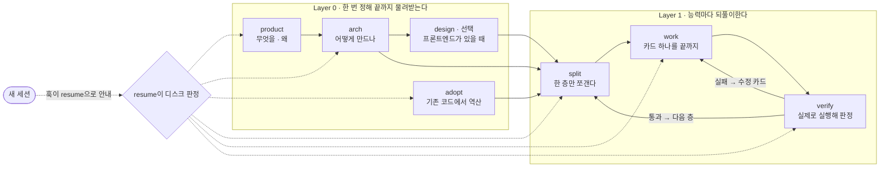
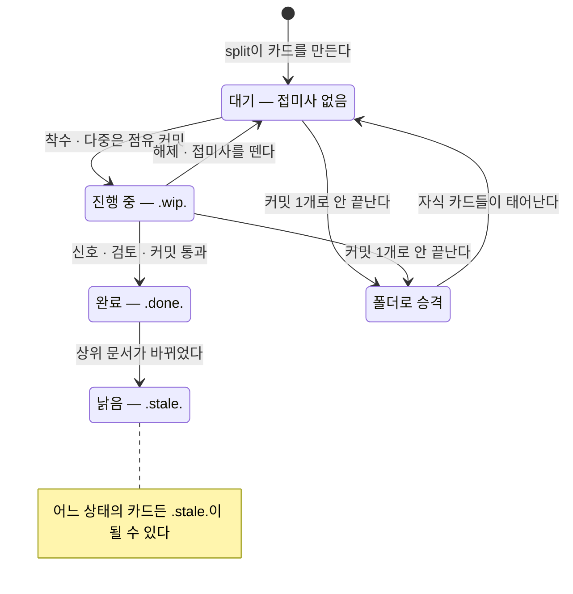
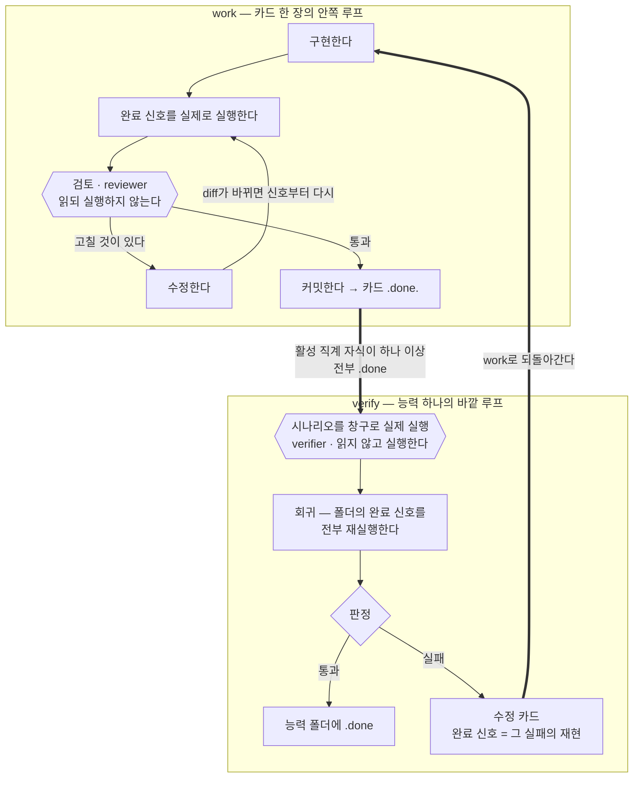
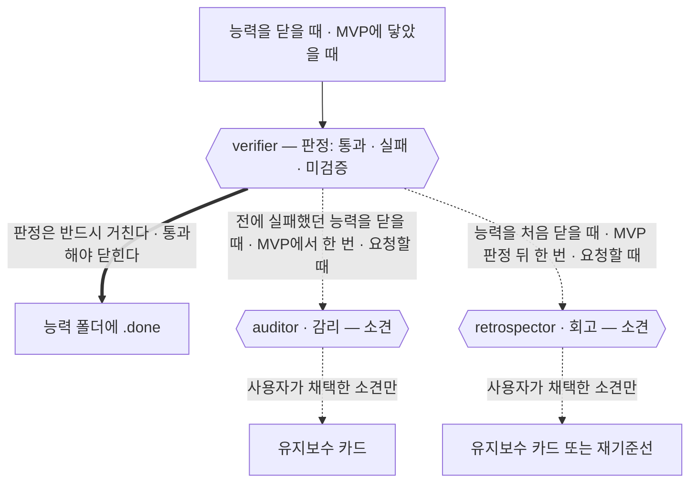
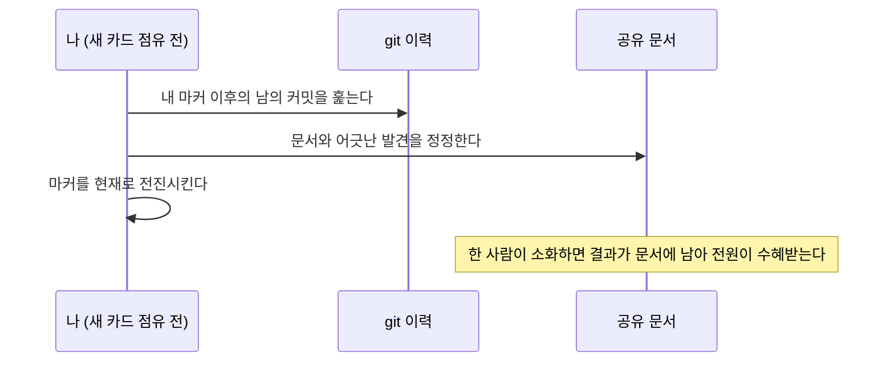

# devflow

> 기획 → 구현 → 검증을 잇는, AI 세션을 위한 개발 흐름. Claude Code · Codex CLI 지원.

**한국어** · [English](README.md)

AI 세션은 매번 기억을 잃고 시작한다. devflow는 그 기억을 대화가 아니라 디스크에 쌓는다.
무엇을 만드는지는 문서가, 어디까지 왔는지는 파일 트리가, 왜 그렇게 정했는지는 기록이
답한다. 어느 세션이 언제 죽어도, 다음 세션은 정해진 몇 개의 파일만 읽고 이어받는다.

## 접근 — 방향은 풍부하게, 하네스는 최소로

최신 상위 모델은 구현 방법을 이미 안다. 절차를 촘촘히 지시할수록 모델은 판단을
멈추고 절차를 따른다. devflow는 반대로 간다: 무엇이 참이 되어야 하는지(목적지),
무엇을 하면 안 되는지(금지 — 3줄 이하), 끝났음을 무엇으로 아는지(실행 가능한 완료
신호)만 분명히 하고, **방법은 지시하지 않는다.** 모델의 성능을 가로막지 않으면서 의도한
방향으로만 흐르게 하는, 최소한의 장치다.

| 분명히 하는 것 | 모델에 맡기는 것 |
|---|---|
| 목적지 — 무엇이 참이 되어야 하는가 | 구현 방법과 코드 패턴 |
| 금지 — 3줄 이하 | 도구와 경로의 선택 |
| 완료 신호 — 실행 가능한 확인 | 문제 풀이의 순서 |
| 좌표·정체성 — 지금 무엇의 일부인가 | 판단이 필요한 모든 지점 |

위 배분은 표준 등급(T-중) 이상 기준이다. 모델은 T-상/중/하 등급으로만 지칭하고, 실제
매핑은 split의 실행 제안에서 정한다. 하네스는 모델 등급에 반비례해서, 하위 등급에 맡기는
카드일수록 읽을 것과 순서 힌트, 금지가 늘어난다.

가볍다고 체계가 없는 것은 아니다. 검토와 검증은 구현 이력을 모르는 독립 컨텍스트가 맡고,
실행하지 않은 것은 통과가 아니라 미검증이며, 하네스는 상상한 위험이 아니라 실제로 겪은
결함이 있을 때만 한 단계 자란다. 루프가 어떻게 돌고 돌 때마다 무엇을 남기는지는 아래
work ⇄ verify 절이 표 하나로 보여준다.

## 흐름



| 상황 | 진입점 |
|---|---|
| 새 프로젝트 | product 부터 순서대로 |
| 기존 프로젝트에 도입 | adopt (코드에서 역산) → split |
| 기능 추가·고도화 | split |
| 새 세션에서 이어하기 | 자동 (SessionStart 훅 — 설치 절 참조) 또는 resume |
| 팀원 합류 | 방 만들기 — 아래 "팀에서 쓸 때" |

### 첫 걸음 — 새로 시작 vs 기존 코드에 도입

**새 프로젝트**는 인터뷰로 시작한다: product가 문제·능력·성공 판정을 묻고(질문은
묶음으로, 모든 질문에 기본값이 붙는다), arch가 스택·구조·검증 창구를 결정하고,
split이 첫 능력을 카드로 쪼개면 work ⇄ verify 루프에 들어간다.

**이미 코드가 있는 프로젝트**는 인터뷰 대신 역산으로 시작한다: adopt가 능력 후보를 먼저
열거하고 후보마다 대표 흐름 하나를 코드에서 끝까지 추적한 뒤
product.md·arch.md·code-style.md·glossary.md를 역산으로 만든다.
product.md는 product 스킬과 같은 형식으로 채우되, 코드가 답할 수 없는 것(안 만들 것,
성공 판정, 문제와 해결 방식의 빈 곳)만 소유자에게 묻는다. 성공 판정은 소유자가 답해
product의 게이트를 통과해야 하고, 그 밖의 무응답만 열린 질문에 남긴다. 이미 완성된 코드는 트리에
소급해 적지 않는다. 트리는 도입 이후의 작업부터 쌓인다. 이후는 같다: split → work ⇄ verify.
기존 핸드오프·사양 문서는 복사하지 않는다. adopt가 `arch.md`에 능력별 정확한 경로만
색인하고, 변경 카드가 현재 코드와 다시 대조한 경로를 `읽을 것`에 적었을 때만 문서를 연다.
따라서 기존 기록 방식은 이어지지만 전역 읽기 비용이나 정본 지위는 얻지 않는다.
도입 후 추적한 변경이 끝나면 그 작업만 닫고 기다린다. 기존 서비스 전체의 제품층 검증은
사용자가 명시적으로 요청할 때만 연다.

## 프로젝트에 무엇이 쌓이나

devflow를 쓰면 대상 프로젝트에 `devflow/` 폴더 하나가 생기고, 그 안에서 문서가
계층적으로 축적된다:

```
devflow/
  project/                     ← Layer 0의 산출 — 자주 안 바뀌는 상위 문서
    product.md                    무엇을 왜 만드나 (능력 목록·성공 판정)
    arch.md                       어떻게 만드나 (스택·구조·잠정값·검증 창구)
    design.md  code-style.md      (선택) 디자인 · 코드 취향 선언
    glossary.md  decisions/       용어집 · ADR
  tree/                        ← 진행 상태의 정본 — 파일명이 곧 상태
    01-foundation/                골조 (공용 토대)
    02-payment/                   능력 하나 = 폴더 하나
      02.1-model.done.md            완료된 카드
      02.2-api.wip.md               진행 중인 카드 (진행 로그가 안에 산다)
      02.3-webhook.md               대기 카드
      verify.md                     능력 검증 기록 (verify가 남긴다)
    03-reporting.md               아직 열지 않은 능력의 제목 한 줄짜리 대기 파일
  journal.md                   ← 작업 간 결정·중단 복구 마커 한 줄씩 (능력이 닫힐 때 정리)
  HANDOFF.md                   ← 휘발성 인계 — 다음 한 걸음·방금 배운 것·함정·열린 결정만, 매번 덮어씀
```

새 프로젝트의 첫 트리는 능력 대기 파일만 만든다. 다음 층에서 `01-foundation/`과 직계
카드를 함께 만들어, 빈 폴더가 완료된 골조처럼 남는 상태를 허용하지 않는다.

**작업 카드 한 장의 일생:**



트리는 재귀다. 큰 카드는 같은 번호의 폴더로 승격되어 계속 쪼개진다(`02.3` → `02.3.1`).
집계 진행률을 기획 문서에 적지 않는 이유는 간단하다. **기획 문서의 진행률은 반드시 낡지만,
파일명은 상태가 바뀔 때만 바뀐다.** 작업 안의 상세 진행은 그 카드의 진행 로그에만 남고,
`ls` 한 번이 전체 진행 보고서다.

1층 능력 폴더에 `.stale.` 아닌 직계 자식이 하나 이상 있고 그 자식이 모두 `.done` 상태이면
verify가 실제로 실행해 검증하고, 통과해야만
폴더에 `.done`이 붙는다(골조 01과 중간 폴더는 검증 없이 닫힌다). 그때 journal도 한 번
정리한다. 효력이 끝난 줄은 지우고, 아직 유효한 줄은 상위 문서로 올리거나 그대로 둔다.
`.stale.` 카드는 이 계산에서 빠지지만 회고가 읽을 역사로 남는다.

## 인계 — 넘기는 시점은 사람이 고른다

세션은 언젠가 끝난다. 그 시점을 정하는 사람은 너다.

AI는 자기 컨텍스트가 얼마나 남았는지 볼 수 없다. 그래서 퍼센트에 건 규칙 대신, 세션은
자기가 볼 수 있는 사건에서만 신호를 보낸다. 새 능력 폴더를 열기 전, 긴 카드에 착수하기
전, 체크포인트 커밋을 찍을 때 다음 걸음이 얼마나 큰지 알려 준다. 잔량을 보는 것도,
"이제 넘기자"고 말하는 것도 사람 몫이다.

넘기라고 하면 그 자리에서 인계가 만들어진다. 순서는 정해져 있다. 이번 대화에서 확정된
결정 중 아직 문서에 안 들어간 것을 먼저 착지시키고(발견→갱신 표), 남는 휘발성만 HANDOFF에
적는다. 그리고 작업 중간이 아니라 **작업 경계에서만** 넘긴다. 절반 짠 코드와 절반만 맞는
설명을 떠넘기지 않으려는 것이다.

다음 세션은 훅의 안내를 받아 resume이 디스크 상태와 HANDOFF를 읽고 이어받는다. 훅 자체는
파일 내용이나 다음 단계를 판정하지 않는다. HANDOFF가 비어 있어도 괜찮다. 트리만으로 재개되는
것이 기본이고, HANDOFF에는 트리에도 카드에도 없는 부스러기만 담긴다.

## 스킬 9개

| 스킬 | 언제 | 만드는 것 | 설계 의도 |
|---|---|---|---|
| product | 새 프로젝트 | product.md · glossary.md | 여기서 정한 능력 이름이 모듈명·폴더명으로 끝까지 같은 단어로 이어진다 |
| arch | product 후 | arch.md · code-style.md | 추측(잠정값)과 결정을 문장 차원에서 분리해 문서가 거짓말하지 못하게 한다 |
| adopt | 기존 코드에 도입 | product.md · arch.md · code-style.md · glossary.md (역산) | 인터뷰 대신 역산 — 코드가 답하는 것은 묻지 않고, 코드가 답 못 하는 것만 소유자에게 묻는다 |
| design | 프론트엔드 있을 때만 (선택) | design.md · 토큰 파일 · /preview | 색·간격의 정본은 문서가 아니라 토큰 파일 하나다 |
| split | 작업 쪼개기 | tree/의 능력 폴더·작업 카드 + 실행 제안(순서·병렬·모델 등급 — 사용자 승인 게이트) | 한 번에 한 층만 연다 — 앞선 구현이 뒤의 분해를 바꾼다 |
| work | 구현 | 코드 · 카드 안 진행 로그 · 커밋 | 실행 전에 로그를 디스크에 — 세션이 언제 죽어도 카드만 읽으면 이어진다 |
| verify | 능력 완료 · MVP 도달 | verify.md · (실패 시) 수정 카드 · (사건 발동) 감리·회고 소견 · (켜져 있으면) 능력 지식 기준선 | 실행하지 않은 것은 통과가 아니라 미검증이다 |
| resume | 새 세션 | 없음 — 상태 보고 후 승인 (다중 모드의 소화 절차만 공유 문서를 정정한다) | HANDOFF와 트리가 충돌하면 트리가 이긴다 |
| principles | 나머지 여덟 스킬이 실행 전에 읽는다 | — | 규칙의 정본은 한 곳에만 산다 |

역할 넷이 동행한다. 서로의 영역을 침범하지 않는 것이 편향을 막는 장치다.

- **reviewer** — 커밋 전에 카드(진행 로그 제외)·diff와 존재하는 code-style.md·glossary.md·journal.md만 읽고 판정한다. 실행하지 않는다.
- **verifier** — 구현 이력을 모른 채 창구 실행만으로 판정한다. 읽지 않는다.
- **auditor(감리)** — 읽고 실행하되 구현 이력을 모른다. 판정 없이 소견만 낸다. 사건이 있을 때만 돈다(아래 감리 문단).
- **retrospector(회고)** — devflow 산출물만 읽고 실행하지 않는다. 설계에 더 나은 선택지가 있었는지 소견으로만 평가한다. 역시 사건이 있을 때만 돈다(아래 회고 문단).

네 역할의 조건은 각각 스킬 옆의 계약 파일 하나다(`skills/work/reviewer.md`,
`skills/verify/verifier.md`, `skills/verify/auditor.md`, `skills/verify/retrospector.md`).
어느 플랫폼에서든 깨끗한 서브에이전트나 새 세션에 그 파일을 원문 그대로 브리핑해서
수행하므로 처리가 같다.

### work ⇄ verify — 안쪽 루프와 바깥 루프



같은 자리를 도는 루프는 없다. 다시 돌려면 무언가를 먼저 바꿔야 하고, 한 바퀴 돌 때마다
무언가가 남는다.

| 루프가 도는 곳 | 반복 전에 바뀌는 것 | 반복이 남기는 것 |
|---|---|---|
| 완료 신호 실패 | 1회: 카드 보강 → 2회: 등급 상승 또는 메인 직접 → 3회: 사람. 같은 프롬프트 재투입 금지 (실패 사다리) | 진행 로그의 시도와 원인 |
| 구현 중 같은 가설 반복 | 2회 실패면 멈춤 — 가설·반증 한 줄, 그대로면 조사 카드 또는 깨끗한 컨텍스트 진단 (고착 탈출) | 로그에 남은 가설과 반증 |
| 검토 지적 | 수정 + 완료 신호 재실행 — 바뀐 코드에 대해 이전 통과는 미검증 | 재검토를 통과한 diff |
| 능력 검증 실패 | 수정 카드 — 완료 신호가 그 실패를 재현한다 | 회귀에 영구 편입되는 신호 |
| 잠정값의 실측 | 상위 문서의 그 행을 교체한다 (환류) | 문서가 기억하는 측정값 |
| 감리 소견 채택 | 사용자 승인 — 채택된 소견만 카드가 된다 | 표본 밖 구멍의 발견, 그 수정의 회귀 편입 |
| 회고 소견 채택 | 사용자 승인 — 채택만 카드 또는 재기준선이 된다 | 설계 선택지의 재평가 기록 |

**감리는 검증이 구조적으로 못 보는 것을 찾는다.** 검증은 이 흐름이 스스로 쓴 시나리오와
신호, 성공 판정을 대조한다. 그래서 시나리오 밖의 구멍이나 스펙이 놓친 기대는 검증으로
드러나지 않는다. 감리는 그 둘을 사냥하려고 세 경우에만 돈다. MVP에 닿았을 때, 전에
검증에서 실패했던 능력을 닫을 때, 사용자가 요청할 때. auditor가 창구를 직접 실행해 보며
살피지만 판정은 내리지 않아서 통과를 막지 않고, 사용자가 채택한 소견만 카드가 된다.
한 번에 깨끗하게 닫힌 능력에는 감리가 붙지 않는다.

**회고는 설계 자체를 향해 한 번 묻는다.** 구현자도 검토자도 지금 설계를 전제로 일하니
"더 나은 선택지가 있지 않았나"는 아무도 묻지 않는다. 그래서 능력을 처음 닫을 때 그 능력
범위로 한 번, MVP에 닿으면 전체를 놓고 한 번 묻는다. 코드는 읽지 않는다. 수정 카드가
몰린 폴더, `.stale.` 카드, ADR에 붙은 갱신 주석처럼 프로젝트가 남긴 흔적만 본다. 소견은
구체적인 대안과 이 프로젝트에서 관측된 긴장 증거를 갖출 때만 성립하고, 채택 여부는
사용자가 정한다.

무언가를 닫는 자리에는 세 겹이 선다. 판정은 반드시 거치고, 소견은 사건이 있을 때만
붙으며, 점선은 아무것도 막지 않는다.



유도하는 결과: **한 번 겪은 결함은 같은 문을 두 번 빠져나가지 못한다.**

## 도메인에 들어갈 때 — 능력 지식 기준선

능력 하나가 검증을 통과해 닫히면 devflow가 그 도메인의 설계도를 쓴다. 능력 하나에 파일
하나, 경로는 `devflow/project/capabilities/NN-<이름>.md`다. **다음 세션도, 새로 합류한
팀원도 그 파일 하나를 읽고 도메인 안으로 들어온다.** 개념 모델, 주 흐름 다이어그램,
사용자가 지금 할 수 있는 일, 불변식, 다시 밟으면 안 되는 함정, 검증하는 방법이 거기 있다.

켜는 것은 arch.md 한 줄이다. arch와 adopt 인터뷰가 이 값을 묻고, 오래 갈 큰 서비스에는
yes를 소형 MVP에는 no를 추천한다. 줄이 없으면 no다.

```
capability_baseline: yes | no
```

낡지 않게 붙잡아 두는 장치가 셋이다. 첫째, **능력이 통과로 닫힐 때마다 파일을 통째로 다시
쓴다.** 연혁 절도 없고, 위에 덧댄 낡은 층도 없다. 둘째, 파일 끝의 기계 블록이 git 명령 두
개로 신선도를 확인한다. 셋째, 그 확인에서 입력이 움직인 것으로 드러난 진술은 가설로
내려간다. 읽는 쪽은 그것을 그대로 믿지 않고 지금 코드에서 다시 확인한다. 기준선은 정본이
아니다. 충돌하면 코드와 ADR이 이긴다.

작업으로는 저절로 흘러든다. 파일이 생긴 뒤로는 split이 새 구현 카드를 만들 때마다 그 능력의
기준선을 카드의 `읽을 것`에 넣고, work는 카드를 열면서 신선도를 한 줄로 보고한다.

사람이 할 일은 적다. 도메인에 들어갈 때 읽는다. 틀렸다고 확인한 줄은 지워도 된다. 다만
더하지는 않는다. 추가는 그 능력이 다음에 통과로 닫힐 때만 들어온다. 능력이 은퇴해도 치울
것은 없다.

이 설계는 소유자가 손으로 굴리던 도메인 인계, 도메인마다 브리핑 문서를 한 장씩 쓰던 관행을
체계로 옮긴 것이다. 강점은 그대로 남는다. 함정, 검증 절차, 읽자마자 방향이 잡히는 감각이다.
신선도와 분량만 기계가 맡았다.

## 설계 원칙

- **진행 상태는 문서가 아니라 파일 트리다.** 접미사(`.wip.` `.done.` `.stale.`)와 위치가 정본.
- **작업 카드가 작업 단위를 전부 정의한다.** 목적지·왜·금지·완료 신호는 카드 한 장에
  담고, 고정 공유 기록(arch·code-style·glossary·journal·직접 의존 카드)은 함께 읽는다.
- **실행하지 않은 것은 통과가 아니라 미검증이다.**
- **1 작업 = 1 커밋.** 완료 신호·검토 통과 후에만. 되돌리기 = revert 하나.
- **측정된 답은 문서로 돌아간다(환류).** 추측은 잠정값 표에 살고, 실측되면 교체된다.
- **핸드오프는 부스러기만.** 위치는 트리가, 과정은 진행 로그가 답한다. HANDOFF에는
  다음 한 걸음·방금 배운 것·함정·열린 결정만 남고, 다 비면 빈 파일이 정상이다.

왜 이렇게 설계했는지의 전문(결정 표·기각 계보)은 [docs/design_ko.md](docs/design_ko.md)에
있다. **결정을 뒤집으려면 기록된 이유부터 반박한다.**

## 팀에서 쓸 때 — 두 모드

devflow는 모드를 **파일 존재로 판별한다** (설정도 플래그도 없다):

```
devflow/users/*/owner.md 가 하나라도 있으면  →  다중 모드
하나도 없으면                              →  솔로 모드 (다중 규칙은 전부 무시됨)
```

**솔로 모드**가 기본이다. 지금까지 설명한 그대로이며 새로 배울 것이 없다.

**다중 모드**는 한 저장소를 여러 사람이 쓸 때다. 팀 전원이 devflow를 쓸 필요는 없다.
쓰는 사람들끼리 충돌하지 않고, 안 쓰는 사람들의 작업도 따라잡는 구조다.
분할의 축은 사람이 아니라 **진실의 범위**다:

```
devflow/
  project/  tree/  journal.md   ← 공유 진실 — 서비스는 하나, 문서도 하나
  users/<id>/                   ← 개인 방 — owner.md(신원) · HANDOFF.md(내 인계) · digest.md(마커)
```

핵심 개념 네 가지:

- **점유(claim)** — 카드를 `.wip-<내 id>.`로 rename하는 커밋. 그때부터 그 카드는 내 것,
  남의 점유 카드는 읽기 전용. 완료되면 무기명 `.done.`이 된다 (소유는 git이 기억).
- **방(room)** — 내 세션 상태의 거처. 자기 방에만 쓰고, 방은 팀 전체가 읽는다.
  마커(digest.md)는 "여기까지 따라잡았다"를 가리키는 커밋 지점이다.
- **소화(digest)** — 남들(devflow를 안 쓰는 팀원 포함)의 커밋을 따라잡는 절차:



- **구속 결정(binding decision)** — 공유 문서·트리 구조·남의 카드에 영향을 주는 결정.
  기능 작업에 실어 보내지 않고 즉시 통합 브랜치(arch 설정에 지정된 다중 전용 브랜치)에
  착지시킨다.

일상에서 늘어나는 습관은 둘뿐이다: 새 카드를 점유하기 전에 **당겨오고 소화한다**,
점유는 **rename 커밋**으로 한다. 나머지는 솔로와 같다.

모드 전환은 전부 커밋 1개짜리 절차다:

| 전환 | 절차 |
|---|---|
| 팀원 합류 | 방 만들기(owner.md) + 마커 = 현재 HEAD. 끝 |
| 솔로 → 다중 | 방 생성 + HANDOFF를 방으로 이동 + `.wip.` → `.wip-<id>.` + 마커 = HEAD |
| 다중 → 솔로 | (마지막 1인) HANDOFF 복귀 + users/ 삭제 + 접미사 원복 + arch의 다중 전용 설정 줄(integration·merge) 제거 |
| 팀원 이탈 | (사용자 선언 후) 남은 누구든: 열린 결정을 journal로 승격(기명) → 그의 점유 해제 → 방 삭제 |

전환이 덜 끝난 상태(다중 모드인데 무기명 `.wip.`이나 루트 HANDOFF가 남음)는 트리를 여는
관문(split·resume)의 정합성 점검이 감지해 알려준다. 조용히 잘못되는 일은 없다. 세션은 git 신원으로 자기
방을 자동으로 찾고, 신원을 해석 못 하는 세션(CI·봇)은 읽기만 한다.

owner.md는 두 줄이다:

```
id: jmp
git: "Jaemin Park", jmp@example.com
```

## 설치

두 플랫폼 모두 이 저장소를 GitHub 주소로 등록하고 플러그인을 설치한다. 각각 두 줄이면
끝나고, 설치되는 내용도 같다. 스킬 9개(역할 계약 파일 동반)와 SessionStart 훅이다.

### Claude Code

세션 안에서 두 줄이면 끝난다.

```
/plugin marketplace add nanomia-ai/devflow
/plugin install devflow@nanomia
```

명령은 `/devflow:product` 형식이다. 플러그인 이름이 네임스페이스라 다른 스킬과 충돌하지
않고, `/devflow`까지만 쳐도 자동완성에 전체가 모여 보인다. 훅은 `devflow/tree/` 또는
Layer 0 문서가 있는 프로젝트에서만 동작하며, 세션 시작·재개·컨텍스트 압축 직후에 공유
resume 절차를 실행하라고 안내한다. 파일 내용과 다음 단계 판정은 resume이 맡는다.

GitHub 공개 전이라면 `marketplace add` 뒤에 저장소를 클론한 로컬 경로를 넣는다.

### Codex CLI

같은 두 줄이다. 스킬과 훅이 함께 설치된다.

```
codex plugin marketplace add nanomia-ai/devflow
codex plugin add devflow@nanomia
```

훅을 쓰려면 `~/.codex/config.toml`에 다음 한 줄이 필요하고, 첫 세션에서 Codex가 이 훅을
신뢰할지 한 번 묻는다.

```toml
[features]
hooks = true
```

스킬은 모델이 알아서 호출한다. `/devflow-work`처럼 **명시 호출용 슬래시 명령**을 함께 두고
싶다면 저장소를 클론해 `codex/install.ps1`(Windows) 또는 `codex/install.sh`(macOS/Linux)를
실행한다. 그 스크립트가 `~/.codex/prompts/`에 명령 8개를 만들고, 네이티브 플러그인 설치가
확인된 뒤에만 0.9.20 이전 설치가 남긴 전역 훅 등록을 제거한다. 설치가 실패하면 기존 훅은
건드리지 않고 명시적인 `/devflow-resume` 호출을 안내한다. 규칙 정본과 동반 문서는 프롬프트마다 동봉한다. 프롬프트 폴더는
평면이라 파일 간 참조가 불안정하기 때문이다.

설치 후 `codex plugin list`에 `devflow@nanomia`가 보이면 성공이다. 안 보인다면 Codex 설정에
**폴더가 사라진 다른 마켓플레이스**가 남아 있는 경우가 많다. 그런 항목 하나가
`codex plugin` 명령 전체를 실패시킨다. `config.toml`(`CODEX_HOME` 또는 `~/.codex`)에서 그
항목을 지우고 다시 시도한다.

> 훅이 하나뿐인 이유: 진행 로그를 매 단계 디스크에 쓰는 규약 덕에 PreCompact 보호가
> 불필요하고, Stop 훅은 매 턴 발화라 소음이다. SessionStart 하나로 충분하다.

## 다른 에이전트 (Cursor, Copilot, opencode 등)

`skills/<이름>/SKILL.md` 구조는 [skills.sh](https://skills.sh) CLI의 표준 형식이라,
`npx skills add <owner>/<repo>` 한 번으로 20여 개 에이전트에 설치된다. 규칙 정본을
skills/ 안(principles 스킬)에 둔 것도 이 때문이다. 스킬 폴더만 복사하는 설치기에서도
정본이 함께 이동한다.

## 더 읽기

- [docs/design_ko.md](docs/design_ko.md) — 설계 철학 · 주요 결정과 이유 · 기각 계보
- [CHANGELOG.md](CHANGELOG.md) — 버전별 변경 이력
- [AGENTS.md](AGENTS.md) — 이 저장소를 수정하려는 사람·AI를 위한 유지보수 게이트
  (이중 언어 워크플로: 한글 `*_ko.md`가 설계 원본, 영문이 배포 실물)

라이선스: [MIT](LICENSE)
