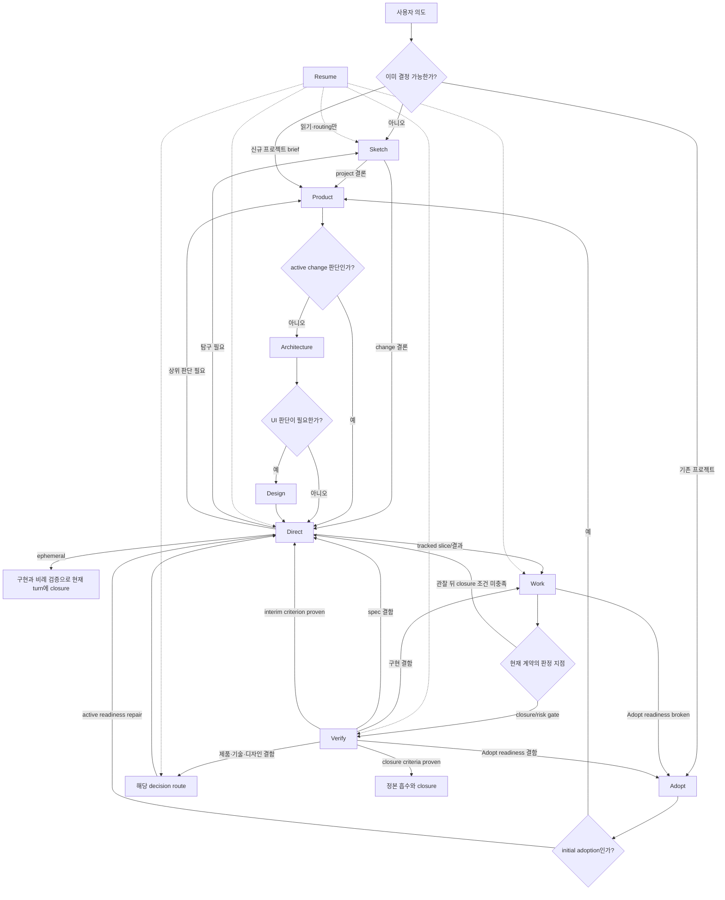

# 스킬 관계와 내부 문서 시스템

## 1. 바로잡은 시스템 경계

대상 프로젝트의 Devflow 지식과 Devflow가 만드는 모든 문서는 `.devflow/` 하나에 산다. `docs/`나
사용자가 유지하던 외부 문서는 Adopt의 입력일 수 있지만, 흡수 뒤 현재 지식의 두 번째 집이나 필수
의존성이 될 수 없다.

시스템은 세 층뿐이다.

1. `.devflow/`: 프로젝트 정본, 진행 중 탐구, 작업 계약·상태·검증, 팀 맥락을 수명별로 나눈 유일한 루트.
2. skills: 열린 질문의 decision route와 정확한 내부 canonical home으로 연결하는 짧은 진입문.
3. Git·코드·테스트·실행 환경: 문서의 이력과 현재 구현을 증명하는 현실. 문서 정본의 병렬 저장소는 아니다.

프로젝트 루트의 `AGENTS.md`, `CLAUDE.md`, plugin manifest, SessionStart hook처럼 host가 정해진 위치에서만
찾는 파일은 **연결부**다. `.devflow/index.md`를 가리키는 최소 포인터만 허용하고 프로젝트 지식·상태·
규칙을 독립적으로 소유하지 않는다. 연결부가 지워져도 발견성이 낮아질 뿐 `.devflow/`의 지식은 손상되지
않아야 한다.

## 2. “소유자(owner)”의 정확한 뜻

최종안에서 owner는 사람, skill, agent, 파일 잠금, Git 작성 권한이 아니다. **어떤 현재 사실이 한 곳에서만
살아야 하는 그 canonical home**이다. 예를 들어 제품 경계의 owner는 Product라는 actor가 아니라
`.devflow/project/product.md`라는 한 경로다. `owner:` metadata를 쓰지 않는 이유도 경로가 이미 답하기 때문이다.

| 구분 | 뜻 | 예 |
|---|---|---|
| owner / canonical home | 현재 진실이 사는 단 하나의 경로 | `.devflow/project/product.md` |
| decision route | 아직 열린 판단을 어느 skill에서 결정하는가 | 제품 질문→Product, 기술 질문→Architecture |
| current actor | 지금 읽고 쓰는 사람·AI | 사용자, Codex, Claude, subagent |
| coordinator | 여러 actor의 순서·병렬성을 정하는 주체 | 단일 agent 또는 외부 orchestrator |

따라서 owner는 옮겨 다니지 않는다. Finding·결함·promotion candidate가 열린 판단이면 적절한 decision
route로 가고, 결정된 현재 사실은 actor가 canonical home에 쓴다. 새 판단이 없는 한 줄짜리 확인 사실을
착지시키려고 Product/Architecture/Design을 의식적으로 재호출할 필요는 없다.

- Sketch는 탐구 질문과 미해결을 기록하고, 열린 판단을 Product/Architecture/Design/Direct로 route한다.
- Direct는 요청·비범위·acceptance를 결정하지만 제품 경계를 조용히 바꾸지 않는다.
- Work는 구현을 결정하고, 확인된 사실을 home에 착지시키며, 열린 상위 판단은 route한다.
- Verify는 판정과 증거를 쓰고 실패 질문을 route하지만 코드·spec·canon을 고치지 않는다.
- Resume은 owner를 만들거나 바꾸지 않고 현재 home과 coordination record를 읽어 다음 route를 안내한다.
- Domain은 별도 actor나 skill이 아니라 canonical home을 나누는 지식 축이다.

## 3. 공개 스킬 아홉 개

각 skill은 `목적 / 진입 gate / 읽을 것 / 직접 쓰는 출력 / 완료 증거 / 다음 경로 / 하지 않는 일`만 가진다.

| 스킬 | 하나의 책임 | 직접 쓰는 내부 경로 | 다음 경로 |
|---|---|---|---|
| `sketch` | 아직 Product나 spec으로 고정할 수 없는 문제·리서치를 결정 가능한 지점까지 좁힌다 | `.devflow/sketches/<id>/` | project→product, change→direct, 열린 판단→해당 route |
| `product` | 목적, 사용자, 가치, 제품 경계·언어와 cross-domain 구도를 결정한다 | `.devflow/project/product.md`, domain의 업무 의미 | foundation 작성은 architecture, active change 판단은 direct |
| `architecture` | 기술 경계, 배치, 의존, runtime/data/검증 방식을 결정한다 | `.devflow/project/architecture.md`와 하위 tree, decision | design 또는 direct |
| `design` | UI가 있는 프로젝트의 시각·상호작용 원칙을 결정한다 | `.devflow/project/design.md`와 하위 tree | direct |
| `adopt` | 기존 코드·문서·운영 증거를 회계하고 자기완결 내부 정본으로 흡수한다 | 일시 `.devflow/adoption/`, 최종 `.devflow/project/` | initial adoption→product, active readiness repair→direct |
| `direct` | 현재 요청을 실행 가능한 변경 계약으로 만든다 | `.devflow/work/<id>/spec.md`, 초기 `state.md` | sketch, 상위 decision route 또는 work |
| `work` | 준비된 한 작업 계약을 구현하고 재개 가능한 현재 상태를 남긴다 | 코드·테스트와 work `state.md` | verify, direct 또는 adopt |
| `verify` | acceptance를 실제 실행으로 판정하고 실패 route와 승격 후보를 정한다 | work `verification.md`, `state.md`의 route | work/direct/adopt/project decision route/closure |
| `resume` | 디스크의 현재 상태에서 active item과 다음 route를 최소 읽기로 찾는다 | 없음(읽기 전용) | 해당 skill 또는 없음 |

Sketch, Product, Adopt 중 최초로 진입한 skill이 `.devflow/index.md`를 만든다. 그 뒤 질문→문서 route가
실제로 바뀐 경우에만 그 변경 actor가 **가장 가까운 부모 index의 route**를 갱신한다. Active artifact는
index에 나열하지 않고 유계 glob으로 찾는다. Resume은 index를
읽지만 고치지 않는다. 별도 Index skill이나 중앙 registry를 만들지 않는 referential-integrity 의무다.

`principles`는 공개 stage로 만들지 않는다. 공통 규칙은 하나의 내부 저작 원본에서 필요한 target으로만
투영한다. `domain`, `land`, `lifecycle`도 처음부터 별도 skill로 만들지 않는다. 실제 반복 실패가
독립 책임을 입증할 때만 다시 검토한다.

## 4. 전체 상호작용



화살표는 전역 상태 기계가 아니라 결과의 질문 유형에 따른 routing이다. 각 skill은 다음 skill의 내부
절차를 복제하지 않는다.

## 5. 유일한 프로젝트 파일 트리

```text
.devflow/
  index.md                          # 관리 표식 + 질문별 최상위 routing; 상세 지식 복제 금지
  project/                          # 장기 현재 지식
    product.md
    architecture.md
    architecture/                  # 독립 독자·변경 이유가 있을 때만
      <concern>.md
    design.md                       # UI가 있을 때만
    design/                         # 독립 독자·변경 이유가 있을 때만
      <concern>.md
    domains/
      <domain>/
        index.md                    # 목적·경계·언어·불변식·하위 지도
        <concern>.md                # read_when이 맞을 때만
    decisions/
      NNNN-<slug>.md                # 현재 결정 이유·기각 대안·재검토 조건
  sketches/                         # 결정 전 임시 지식
    S-<slug>-<short-id>/
      brief.md                      # 질문·scope·배경·목적지 후보
      state.md                      # next route/action·blocker·미해결 landing
      findings/                     # 조건부 독립 조사 질문일 때만; transcript 금지
        01-<concern>.md

  work/                             # 실행 중 임시 지식
    W-<slug>-<short-id>/
      spec.md                       # Direct가 쓰는 실행 계약의 canonical home
      state.md                      # work 전체의 유일한 현재 상태
      verification.md              # Verify의 최신 판정과 유계 실패 기억

  team/                             # 개인별 임시 맥락
    <member>/
      <artifact-id>.md              # active Sketch/Adopt/Work의 개인 인계면

  adoption/                         # Adopt가 진행 중일 때만 존재
    state.md
    sources.md                      # 입력 회계와 내부 landing target
    conflicts.md                    # source로 풀 수 없는 모순·결정만
```

모든 디렉터리를 미리 만들지 않는다. `index.md`와 현재 필요한 경로만 만든다. 완료된 sketch, work,
adoption 과정은 현재 트리에 묘비나 archive로 남기지 않는다. Git merge 전략에 따라 과정 일부가
보존될 수 있지만, 현재 correctness는 임시 이력의 영구 보존에 의존하지 않는다.

Artifact identity와 병렬 write 경계는 [08-document-contracts.md](08-document-contracts.md) §8이 소유한다.
여기서는 서로 다른 작업이 별도 artifact를 사용하고 상충하는 코드·정본 변경은 Git/PR에서 통합한다는
구조만 고정한다.

`index.md`는 상세 지식을 복사하지 않지만 plugin이 없어도 재개할 수 있는 짧은 orientation 절차를
소유한다.

1. 파일과 Architecture의 Design applicability 문장에서 Product·Architecture·optional Design readiness를 파생한다.
2. immediate `sketches/*/state.md`, `adoption/state.md`, `work/*/state.md`만 열거한다.
3. 현재 checkout의 Git bytes/revision과 state intent/next action을 비교하고, active artifact가 없는 dirty
   changes는 unowned work로 보고 Direct/user에 route한다. Active artifact의 불일치는 `continue`,
   `reconcile`, `abandon` 중 가능한 처분을 보고한다.
4. Verification이 proven인데 pending landing이 남은 work를 먼저 보고한다.
5. active item이 여러 개면 사용자의 선택을 받고, 하나면 next route/action과 최소 read set을 반환한다.

Resume skill은 이 절차를 복제하지 않고 `.devflow/index.md`를 열게 하는 host door와 읽기 전용 금지만
가진다. Resume은 현재 checkout만 보고하며 다른 branch/worktree의 선택·집계는 Git 또는 외부
orchestrator 책임이다.

## 6. gate: 폴더 존재와 준비 상태를 분리한다

Sketch만 시작해도 `.devflow/`가 생기므로 폴더 존재만으로 managed-ready를 판정하면 안 된다.

| 디스크 상태 | 허용 진입 |
|---|---|
| `.devflow/` 없음 | `sketch`, `product`, `adopt`만 쓰기 가능 |
| `.devflow/`는 있으나 index가 없거나 읽을 수 없음 | 기존 파일을 읽기 전용으로 inventory하고 새 bootstrap으로 취급하지 않는다. 남은 project/artifact가 가리키는 bootstrap route가 index만 복구하며, route도 불명확하면 사용자에게 확인한다. |
| index + active sketch만 있음 | `sketch`, `product`, `adopt`, 읽기 전용 `resume`; direct/work/verify 거절 |
| `project/product.md`만 있음 | product, architecture, optional design, sketch, adopt, resume |
| 완결된 Product + Architecture가 공개됐고 adoption이 닫힘 | 모든 skill; work/verify는 유효 work 계약도 필요 |
| `adoption/`이 존재함 | adopt와 필요한 decision route가 기본. Tracked 변경은 08 §5의 adoption readiness 계약을 만족한 경계만 허용 |

Eligibility/gate와 route vocabulary는 Skill Rails source graph의 한 authored owner에서 host description과
skill entry로 투영한다. 두 target이 독립 문장으로 gate를 재작성하지 않는다. SessionStart hook은 index
pointer를 줄 수 있지만 gate의 진실을 소유하지 않는다.

Canonical 경로는 drafting surface가 아니다. 한 custody interval 안에서 완결할 수 있으면 내용을 먼저
구성한 뒤 canonical 파일을 교체한다. 여러 세션이 필요한 Product·Architecture·Design 작성은 Sketch
route를 통해 active Sketch에 draft와 현재 snapshot을 두고, 완결본만 canonical home으로 옮긴다.
명확한 brief에서 Product로 직행해도 완결 전에 관리권이 바뀌면 이 경로로 전환한다. 전역 bootstrap
lifecycle은 만들지 않는다.

## 7. Header와 선택적 읽기

공통 header와 조건부 분해 계약은 [08-document-contracts.md](08-document-contracts.md) §§2–2.1만
소유한다. 구조적으로 `.devflow/index.md`는 최상위 질문 route와 bounded Resume orientation만 맡고,
domain·architecture·design의 부모 문서는 자기 subtree만 route한다. 누락·죽은 link·반복 misroute가
관찰되기 전에는 generator를 만들지 않는다. K를 다시 만들지 않는 근거는
[09-reference-boundaries-and-document-decomposition.md](09-reference-boundaries-and-document-decomposition.md)가
보존한다.

## 8. 질문의 decision route와 canonical home

Product, Architecture, Design, Direct, Work, Verify는 열린 질문의 decision route다. Domain tree는 지식
분할 위치이고 work/member 파일은 coordination record다. Skill이나 파일을 혼용해 owner라고 부르지 않는다.

| 현재 사실·판단 | 열린 질문의 decision route | owner / canonical home |
|---|---|---|
| 목적·사용자·가치·제품 언어·프로젝트 경계·cross-domain 구도 | Product | `.devflow/project/product.md` |
| domain의 업무 의미·상태·불변식 | Product | `.devflow/project/domains/<domain>/index.md` |
| 기술 구조·배치·의존·runtime/data·검증 채널과 domain 기술 concern | Architecture | `.devflow/project/architecture*` 또는 domain의 한 technical child |
| UI·상호작용 원칙과 domain UI concern | Design | `.devflow/project/design*` 또는 domain의 한 design child |
| 현재 결정의 이유·기각 대안·재검토 조건 | 질문에 맞는 Product/Architecture/Design | `.devflow/project/decisions/` |
| 현재 변경의 목표·비범위·acceptance | Direct | work `spec.md` |
| 구현 방법·코드·테스트의 현재성 | Work | 코드·테스트와 work coordination state |
| criterion별 판정·증거·실패 route | Verify | work `verification.md` |

Coordination record에는 역할별 배타적 writer 표를 만들지 않는다. 현재 artifact의 custody를 가진 actor가
그 snapshot을 쓰되 다음 두 경계만 지킨다.

1. goal·non-goal·acceptance를 바꾸는 contract amendment는 원래 계약과 같은 결정 권한을 거쳐 spec에
   반영한다. Work가 구현 편의를 위해 조용히 바꾸지 않는다.
2. verification verdict는 구현과 구분된 actor 또는 독립적인 검증 context가 증거와 함께 쓴다.

Member file은 해당 actor만 쓰고 공유 사실의 집이 아니다. Parent index route는 실제 route를 바꾼 actor가
같은 변경에서 갱신한다. 외부 coordinator는 순서와 병렬성만 정하며 project 파일 writer가 아니다.

Decision 문서는 현재 규칙의 사본이 아니다. 현재 규칙은 Product/Architecture/Design 정본과 Domain tree에 반영하고,
decision은 왜 그 방향이 현재 유효한지와 무엇이 생기면 다시 여는지만 소유한다.
Decision ID는 한 결정 질문의 identity다. 같은 질문의 결론이 바뀌면 기존 파일을 현재형으로 교체하거나
삭제하고, 새 번호는 독립된 새 질문에만 쓴다. 과거 결론은 Git에서 복구한다.

## 9. phase 열거 없는 국소 coordination state

전역 lifecycle도 artifact별 phase enum도 만들지 않는다. 임시 artifact의 `state.md`는 다음 행동을
복구하는 최소 좌표만 가진다.

```yaml
next_route: sketch | adopt | product | architecture | design | direct | work | verify | user
next_action: 하나의 bounded 행동
blockers: []
```

필요한 artifact만 추가 필드를 가진다.

- Sketch: `unresolved_findings`와 finding별 `destination`.
- Adopt: 상세 coverage와 conflict는 각각 `sources.md`, `conflicts.md`만 소유한다.
- Work: `base_revision`, `last_safe_point`, optional `knowledge_candidates`, `pending_landings`.

State는 로그가 아니라 현재 스냅숏이다. 어떤 stage든 현재 행동을 완결하기 전에 세션·actor·branch로
관리권이 넘어갈 수 있으면 먼저 자기 artifact state를 갱신한다. Product·Architecture·Design의
다중-session 판단은 Sketch, Adopt는 adoption state, Direct·Work·Verify는 work state가 이 역할을
맡는다. 마지막 안전 지점과 다음 행동을 남기는 이 원칙 하나로 host별 중단 사례를 따로 열거하지 않는다.

판정은 중복 status 없이 파생한다.

| 질문 | 판정 |
|---|---|
| active인가 | 임시 artifact 폴더가 존재한다 |
| blocked인가 | `blockers`가 비어 있지 않다 |
| 다음에 어느 경로에서 무엇을 하나 | `next_route`와 `next_action` |
| 실행 가능한 spec인가 | blocker가 없고 `next_route: work`이며 spec 계약이 완결됐다 |
| 검증 결과는 무엇인가 | sibling `verification.md`만 읽는다 |
| 승격이 남았나 | Work state의 `pending_landings`가 비어 있지 않다 |
| 완료됐나 | 필요한 landing 뒤 폴더가 삭제됐고 결과가 project/code/Git에 존재한다 |

Verification의 criterion verdict만 `proven | failed | unproven`을 가진다. 이 verdict를 state에
요약하거나 phase로 다시 쓰지 않는다. 이는 상태 기계를 없애면서 사용자가 묻는 준비·진행·막힘·완료를
모두 디스크에서 판정하게 한다.

오래 남은 폴더를 자동으로 완료나 폐기로 해석하지 않는다. Resume은 실제 Git과 snapshot을 비교해
continue/reconcile/abandon route만 보고하며, custody actor가 partial code·pending landing·team file을
명시적으로 처분한 뒤 artifact를 삭제한다. TTL, garbage collector, `abandoned` 상태 enum은 만들지 않는다.

## 10. Sketch 산출물과 흡수

대화가 시작됐다고 바로 문서를 만들지 않는다. 중단 뒤 보존해야 할 질문·결정·조사 단위가 처음 생길
때 지역 고유 Sketch ID를 만든다.

- `brief.md`: project/change scope, 지배 질문, 현재 배경, 비범위.
- `state.md`: next route/action, blocker, finding별 destination과 landing condition의 유일한 목록.
- `findings/*.md`: brief에서 본문을 열기 전에 선택 가능한 독립 조사 질문이고 별도 읽기·변경 이익이
  탐색 비용보다 클 때만 만든다. 사실/추론/사용자 결정 필요, 증거와 현재 결론만 두고 destination이나
  대화 transcript를 저장하지 않는다.

Project sketch의 landing destination은 주로 Product이고, 기술·UI finding은 Architecture/Design이
해당 단계를 시작할 때 흡수한다. Change sketch는 Direct spec으로 필요한 결정만 돌려주되, 프로젝트
전체에 계속 참인 사실은 먼저 해당 project canonical home에 착지시킨다. landing이 끝나면 sketch 폴더를
삭제한다. 따라서 조사 원문과 현재 정본이 장기 공존하지 않는다.

## 11. Direct → Work → Verify의 파일 계약

세 문서의 완전한 필드·본문·publication 계약은
[08-document-contracts.md](08-document-contracts.md)가 유일하게 소유한다. 여기서는 skill routing에 필요한
경계만 둔다.

Direct는 실행 계약을, Work는 구현과 현재 좌표를, Verify는 acceptance 판정을 담당한다. Ephemeral은
현재 turn에 닫히며 durable work artifact를 만들지 않는다. Tracked 작업은 `spec.md`, `state.md`, 필요할
때의 `verification.md`로 중단과 독립 판정을 견딘다. Adaptive spec, artifact identity, amendment,
publication, ephemeral/tracked 판정의 실행 계약은 08 §6만 소유한다.

## 12. 지식 상승과 closure

다음 네 조건을 모두 만족한 결과만 장기 정본으로 올린다.

1. 다음 작업자의 판단을 실제로 바꾼다.
2. 현재 코드·실행 증거와 모순되지 않는다.
3. 하나의 canonical home을 지정할 수 있다.
4. 진행 서사가 아니라 현재 유효한 사실·결정·함정이다.

Work가 구현 중 발견한 후보를 state의 optional `knowledge_candidates`에 남긴다. Verify는 supporting
evidence를 `verification.md`에 기록하고 확인된 후보를 state 목록에 합친다. Work closure가 후보를
채택하거나 기각한다. 아직 판단이 필요한 질문은
route를 명시한 `blockers`로 보내고, 확인된 현재 사실만 `fact → canonical path` 형태의
`pending_landings`로 만든다. Work actor가 home 반영을 확인해 pending을 비우고 최종 삭제한다. 외부
coordinator는 순서만 정하고 파일을 쓰지 않는다. 별도 Land skill은 같은 누락이 반복 관찰되기 전에는
만들지 않는다.

## 13. Adopt의 완전 흡수 계약

Adopt는 원자료를 영구 참조하는 migration이 아니라 지식 소유권을 이전한다. 실제 운영된 구버전
Devflow 프로젝트는 없으므로 legacy state/file/API를 인식하는 upgrade path는 만들지 않는다. Adopt의
대상은 Devflow 표식이 없는 임의의 기존 프로젝트다.

1. 코드·주석·문서·테스트·설정·운영 증거를 `sources.md`에서 빠짐없이 회계한다. Source group은 명시한
   include/exclude 경로로 입력 집합을 완전히 partition하고 uncovered path가 0이어야 한다. 유지 문서는
개별 disposition을, 균질한 코드·테스트·설정은 같은 canonical home으로 함께 처리할 근거가 있는 bounded group을 허용한다.
2. 각 지식 단위를 `observed fact / interpretation / conflict / unknown`으로 분리하고 정확한 내부
   canonical target을 정한다.
3. Product·Architecture·Design·Domain tree를 자기완결 문장으로 작성한다. 외부 문서를 다시 열어야
   이해되는 요약이나 링크 포인터는 불완전한 landing이다.
4. 코드나 live 운영 자산은 현재 증거로 계속 존재할 수 있지만, 기존 문서 경로는 정본 권위를 잃는다.
   기존 문서는 삭제·현재 검색면 밖으로 이동·host가 필요한 최소 pointer로 치환하는 것이 기본이다.
   사용자가 별도 목적으로 원문을 유지하면 실제 진입문에서 “Devflow project truth가 아님”이 분명해야 하고
   내부 정본에 없는 유일 지식을 담을 수 없다.
5. source로 풀 수 없는 모순만 `conflicts.md`에 남기고 질문 유형에 맞는 decision route로 보낸다.
6. 모든 source group이 내부 landing, 명시 conflict, 또는 위 조건을 만족하는 비정본 보존으로 처분되고
   uncovered path가 0이면 adoption 폴더를 삭제한다. 파일 coverage는 완전한 이해의 증명이 아니므로 대표
   domain 질문, 입력 삭제, 고의로 모순된 retained 문서가 남은 fresh-agent 시나리오로 의미 흡수를 따로 검증한다.

이후 외부 입력이 삭제·이동되어도 `.devflow/project/`만으로 프로젝트의 목적·경계·결정 이유를 이해할
수 있어야 한다. 과거 내용이 현재에 남아야 할 유일한 경우는 기각 이유가 현재 결정을 지키는 때이며,
그때도 외부 원문이 아니라 현재 decision 문서에 자기완결적으로 흡수한다.

문서 전체에 `status: reconstructed`를 붙이지 않는다. 한 문서 안에서도 확인된 사실과 해석이 섞일 수
있어 첫 변경이 doc 전체를 검증한 것처럼 만들기 때문이다. 아직 확인되지 않은 해석은 그 정확한 문장
옆에 `확인 근거 / 남은 불확실성 / 확인할 조건`을 현재 지식으로 적고, 확인되면 그 자리에서 교체한다.

## 14. 팀 맥락과 Resume

공유 사실은 활성 artifact의 `state.md`, 개인의 환경·시도 직전 맥락은
`team/<member>/<artifact-id>.md`에 둔다. member 문서는 공용 정본이 아니며 선택한 artifact에 대해
`team/*/<artifact-id>.md`라는 유계 glob으로만 보조 읽는다. 이는 Work뿐 아니라 중단될 수 있는
Sketch와 Adopt에도 같다.

활성 artifact 하나의 state snapshot은 한 시점에 한 actor만 쓴다. 병렬 작업은 서로 다른 artifact와
안정적인 seam을 우선하되 코드·정본 write scope 중첩 자체는 금지하지 않는다. shared mutable state·
lock·room·claim은 만들지 않는다. 관리권이 바뀌기 전에 현재 행동을 끝낼 수 없으면 해당 artifact state를 진행 로그가 아닌 최신 스냅숏으로
교체한다. Product·Architecture·Design의 장기 탐색에는 Sketch artifact가 checkpoint를 제공한다.

Resume은 §5의 index orientation을 따른 뒤 선택한 item의 spec/brief, 같은 artifact ID의 member file,
next route가 요구하는 project 문서만 연다. 결과는 `active items / 불일치·blocker / 다음 route와 행동 하나 /
최소 read set`이며 파일을 만들거나 상태를 고쳐 정합성을 꾸미지 않는다.

Active item이 0개여도 곧바로 “진행 중 없음”이라 하지 않는다. Product가 없으면 bootstrap 가능 상태,
Product만 완결됐으면 Architecture, Architecture가 Design 필요를 선언했고 Design이 없으면 Design을 다음 route로 보고한다.
반쪽 canonical 파일이나 index/verification/state 불일치를 발견하면 작업을 실행하지 않고 정확한 복구
writer·decision route와 경로를 보고한다.

## 15. Skill Rails 저작 경계

하나의 source package에서 아홉 prose target을 만들되, Skill Rails를 프로젝트 runtime engine으로 쓰지
않는다. Build는 전달을, fresh-use는 행동을 증명한다. Entry·module·checker의 구체 작성 계약은
[08-document-contracts.md](08-document-contracts.md) §9만 소유한다.
