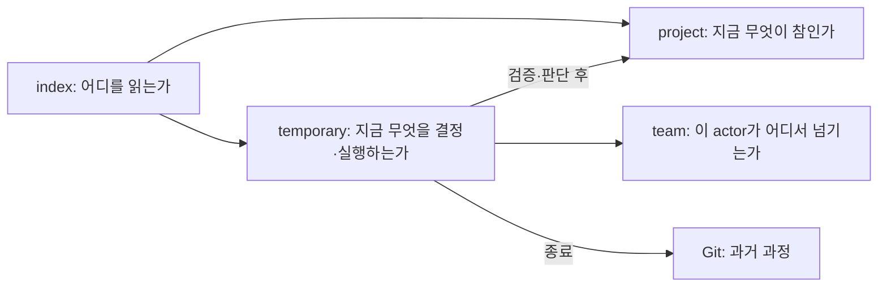

# 문서 계약과 작성 경계

## 1. 문서를 만드는 이유

Devflow 문서는 활동을 증명하기 위한 기록이 아니다. 다음 사람이나 AI가 과거 대화를 재구성하지 않고
현재 질문을 판단하거나 다음 행동을 안전하게 시작하게 하는 지식 인터페이스다. 따라서 각 문서는
**한 가지 독자 질문**에 답하고, 그 질문에 필요 없는 과정·대화·다른 문서의 내용을 복제하지 않는다.



## 2. 모든 문서의 공통 계약

1. **질문 하나:** 문서 제목과 첫 문단만으로 이 문서가 답하는 질문을 말할 수 있어야 한다.
2. **자기완결:** 판단에 필수인 배경·의도·제약은 본문에 쓴다. 외부 issue나 Adopt 원문은 출처 표지일
   뿐 현재 의미의 필수 의존성이 아니다.
3. **현재형:** 현재 유효한 사실·결정·상태만 남긴다. 활동 일지와 이전 판본은 Git이 보존한다.
4. **한 소유 경로:** 같은 사실을 여러 문서에 요약하지 않는다. 다른 질문은 링크와 `read_when`으로
   보낸다.
5. **증거와 해석 분리:** 관측 사실, 해석, 미확정 사항, 확인 조건이 섞이지 않게 쓴다.
6. **적응형 본문:** 아래 절은 반드시 전달해야 할 정보 계약이다. 해당 정보가 없으면 빈 절을 만들지
   않고, 프로젝트 언어에 더 자연스러운 제목으로 바꿀 수 있다.
7. **짧은 방향 표지:** AI가 전체 본문을 열기 전에 관련성을 판단할 수 있도록 Devflow가 만든 Markdown은
   다음 최소 header를 갖는다. `id`, `owner`, 날짜, tags, `status: current`는 기본 필드가 아니다.

```yaml
---
summary: 이 문서가 현재 답하는 질문과 결론을 한두 문장으로 설명한다.
read_when:
  - 이 문서를 열어야 하는 구체적 질문이나 조건
---
```

`index.md`는 항상 읽는 문서이므로 `read_when`에 그 사실을 쓸 수 있다. State처럼 기계 판독이 필요한
작업 좌표는 header가 아니라 그 문서가 소유하는 현재 스냅숏 블록에 둔다.

## 2.1 조건부 분해 계약

길이는 분해 판정이 아니라 재검토 신호다. 짧아도 조건부로만 필요한 독립 계약이면 나눌 수 있고,
길어도 한 판단에서 함께 읽고 바뀌면 하나로 둔다. 자식을 만들기 전에 다음 순서를 모두 통과한다.

| 순서 | 판정 질문 | 통과하지 못하면 |
|---|---|---|
| 0. owner·수명 | 이 내용은 지금 이 parent가 소유할 현재 지식인가? 장기 사실, 임시 조사, 실행 계약 중 수명이 맞는가? | 올바른 Product·Domain·Architecture·Design·Decision 또는 transient artifact로 먼저 옮긴다. 잘못된 배치를 child로 고착하지 않는다. |
| 1. 사전 선택 | 현재 질문, affected domain/surface, 부모 route와 자식 header만으로 본문을 열지 말지 판단할 수 있는가? | 부모에 둔다. 자식을 읽어야 `read_when`을 이해할 수 있으면 분리 이익이 없다. |
| 2. 의미 응집 | 자식이 하나의 독자 질문과 변경 이유를 가지며, 답을 바꿀 때 형제 전체를 함께 재해석하지 않아도 되는가? | 함께 판단되는 내용을 같은 문서에 둔다. 기술명·폴더명·제목만 다르다는 이유로 자르지 않는다. |
| 3. 총비용 | 피하는 무관한 읽기·판단 오류·편집 충돌이 route 유지·왕복·맥락 재구성·link drift보다 큰가? | 먼저 중복·과정 서술·낡은 내용을 줄인다. 빈도나 줄 수의 숫자 gate를 만들지 않는다. |

드물더라도 보안·배포처럼 불필요한 대용량 지식이 판단을 흐릴 위해가 크면 3번의 이익이 있을 수 있다.
반대로 child가 실제 작업에서 늘 부모·형제와 함께 읽히고 함께 바뀌면 다시 합친다. Split과 fold 모두
길이로 결정하지 않는다.

분해 뒤의 read bundle은 `부모의 공통 배경·불변식 + 선택한 자식의 concern 계약`이다. 자식 하나가
상위 문맥을 모두 복제하는 것을 자기완결로 부르지 않는다. 다음 불변식을 지킨다.

- 같은 현재 사실은 부모와 자식 중 한 canonical home에만 둔다.
- 부모는 모든 독자가 공유하는 배경·경계·불변식과 현재 질문→자식 route를 소유한다.
- 자식은 적용 조건, concern-specific 배경과 현재 계약을 소유하며 부모의 결론을 요약하지 않는다.
- 형제는 하나의 명목상 taxonomy를 공유할 필요가 없다. 부모의 질문→자식 route가 서로 모호하게
  경쟁하지 않고 같은 사실의 canonical home을 가르지 않아야 한다.
- 자식도 같은 판정을 다시 통과하면 깊어질 수 있다. 대부분의 작업이 대부분의 형제를 열면 접는다.
- 부모 route와 자식 `summary/read_when`은 같은 변경에서 갱신하고 현재 tree에 redirect·묘비를 쌓지 않는다.
- 자식은 독립 entry가 아니다. Route나 spec의 `read_first`가 자식을 직접 지목하면 가장 가까운 부모를
  먼저 read bundle에 포함한다. 이미 상위 route에서 읽었다면 다시 열지 않는다.

부모 route는 고정 schema가 아니라 `현재 질문·조건 → 읽을 자식`을 본문을 열기 전에 고를 수 있는 짧은
지도면 충분하다. `이 기능을 작업할 때`처럼 부모 전체와 같은 조건이나 framework·담당자 이름만으로
분기하지 않고, 독자가 바꾸려는 계약을 조건으로 쓴다.

| 문서 | 부모에 남길 것 | 조건부 자식의 기준 | 만들지 않을 분할 |
|---|---|---|---|
| Architecture | 시스템 경계, 안정 기술 불변식, 구성요소 관계, 의존 방향, runtime/data 큰 흐름, 공개 seam, 검증 channel, route | 특정 기술 concern을 다른 작업이 안전하게 건너뛰고 그 concern이 독립 계약·변경 이유를 가질 때. frontend/backend/validation/security/operations는 가능한 사례일 뿐이다. | framework·폴더별 파일, Domain 업무 의미, 길이를 맞추는 절 분할 |
| Design | 전체 경험 원칙, foundation 전략, 공통 interaction·접근성·반응형·상태 원칙, review surface, route | 특정 surface·상호작용 계열이 다른 UI 작업에서 생략 가능하고 독립적으로 적용·검토될 때 | component마다 한 파일, 페이지별 기록, Domain 업무 규칙 복제 |
| Domain | 업무 목적·경계·핵심 언어, 대표 상태·불변식, 다른 Domain과의 계약, route | lifecycle·정산·권한·외부 연동 같은 업무 concern이 독립 질문이고 다른 변경에서 생략 가능할 때 | API/DB/UI별 기계 분할, 상태 하나당 한 파일, 기술 규칙 복제 |
| Spec | 요청 배경·의도, goal/non-goal, acceptance와 필요할 때의 shaping 정보, 공통 제약, read-first, 전체 write boundary와 unit map | 기본값은 한 closure당 한 spec이다. 결과를 독립 수용·취소·검증할 수 있을 때만 별도 Work artifact로 나누고, 공유 integration acceptance가 있으면 일반 Work artifact가 그것을 닫는다. 큰 evidence·test matrix는 실제 조건부 읽기 이익이 증명될 때만 보조 자료를 검토한다. | 구현 파일별·작업 단계별 spec child, worker가 전체 의도를 재구성해야 하는 분할 |

AI는 `공통 질문·불변식 식별 → owner·수명 확인 → 후보 concern에 gate 적용 → 부모 route와 자식 동시
갱신 → 부모만/자식 하나/cross-cut 작업으로 확인`의 최소 순서만 따른다. 애매하면 현재 문서를 유지하고
실제 misread·불필요한 개봉·독립 변경 장면을 관찰한다. 새 이름·번호·registry를 만들어 애매함을
가리지 않는다. 근거 계보와 K에서 보존·폐기한 경계는
[09-reference-boundaries-and-document-decomposition.md](09-reference-boundaries-and-document-decomposition.md)에만 둔다.

## 3. 장기 현재 지식의 본문 계약

| 문서 | 답해야 하는 질문 | 본문에 필요한 정보 |
|---|---|---|
| `.devflow/index.md` | 지금 어떤 질문이면 어디부터 읽는가 | 프로젝트 한 줄 설명, foundation 경로와 readiness 파생 규칙, 질문→정본 route, active artifact를 찾는 유계 glob, Resume orientation 절차, 비정본 경계 |
| `project/product.md` | 누구의 어떤 문제를 어떤 경계 안에서 해결하는가 | 문제·사용자/역할·가치, 제품 경계와 비범위, 핵심 언어, cross-domain 구도, 제품 불변식, 열린 제품 질문 |
| `project/architecture.md` | 시스템을 어떤 기술 경계와 방향으로 구성하는가 | 환경·구성요소, 배치와 의존 방향, runtime/data 흐름, 공개 seam, 검증 채널, Design applicability, concern tree route, 열린 기술 질문 |
| `project/architecture/<concern>.md` | 특정 기술 concern에서 무엇이 현재 규칙인가 | 적용 조건, 결정된 구조·계약, 근거와 trade-off, 실패/운영 경계, 관련 domain·검증, 부모 route |
| `project/design.md` | UI가 있을 때 어떤 경험 원칙과 체계를 따르는가 | 사용자 경험 원칙, foundation/token/component/interaction 전략, 접근성·반응형·상태 원칙, 상세 tree route, review surface |
| `project/design/<concern>.md` | 특정 UI concern을 언제 어떻게 판단하는가 | 적용 조건, 현재 패턴·제약, 상태/변형, 접근성·검토 기준, 관련 domain과 부모 route |
| `project/domains/<domain>/index.md` | 이 domain은 무엇을 소유하고 어디까지인가 | 목적·경계, 핵심 용어, 상태·규칙·불변식, 다른 domain과의 계약, 하위 문서 route, 열린 질문 |
| domain 상세 문서 | 한 domain concern의 현재 지식은 무엇인가 | concern의 범위, 현재 규칙·예외, 입력/출력 또는 상태 변화, 근거·검증, 관련 계약과 부모 route |
| `project/decisions/<id>-<slug>.md` | 현재 결정을 지키는 이유와 재검토 조건은 무엇인가 | 결정 질문, 현재 결론, 맥락·제약, 고려한 대안과 기각 이유, 영향, 재검토 조건, 반영된 canonical home |

Decision 문서는 규칙 사본이 아니다. 현재 규칙은 Product·Architecture·Design·Domain에 있고, Decision은
그 방향이 아직 유효한 이유만 소유한다. 같은 결정 질문의 결론이 바뀌면 같은 파일을 교체하며 과거는
Git에서 본다.

## 4. Sketch 문서 계약

| 문서 | 답해야 하는 질문 | 본문 계약 |
|---|---|---|
| `brief.md` | 왜 무엇을 탐구하는가 | project/change scope, 지배 질문, 배경과 의도, 이미 아는 사실, 비범위, 결정 기준 |
| `state.md` | 지금 무엇이 미해결이며 다음 행동은 무엇인가 | `next_route`, `next_action`, `blockers`, unresolved finding 목록과 각 destination |
| `findings/<concern>.md` | 이 조사 단위가 결론에 주는 영향은 무엇인가 | 질문, 관련 증거, 관측과 해석, 선택지/trade-off, 현재 결론 또는 unknown, 확인 조건 |

Finding은 brief의 지배 질문 아래에서 본문을 열기 전에 선택 가능한 독립 조사 질문이고, 별도 읽기·변경
이익이 탐색 비용보다 클 때만 분리한다. 길이만으로 분리하지 않는다. 대화 transcript, 검색 결과 나열,
state의 destination 사본은 만들지 않는다. landing이 끝나면 채택된 결론만 정본이나 spec에 자기완결
문장으로 흡수하고 Sketch 폴더는 삭제한다.

## 5. Adopt 문서 계약

| 문서 | 답해야 하는 질문 | 본문 계약 |
|---|---|---|
| `adoption/state.md` | 흡수 작업의 현재 좌표와 다음 행동은 무엇인가 | `next_route`, `next_action`, blockers; coverage와 conflict 상세는 sibling 문서가 소유 |
| `adoption/sources.md` | 유지 source 전체가 어떻게 처분되는가 | group별 include/exclude 경로, source 성격·권위, 찾을 지식 종류, target home, disposition, uncovered 수 |
| `adoption/conflicts.md` | source만으로 풀 수 없는 모순은 무엇인가 | 충돌 진술, 양쪽 증거, 영향, 이미 배제한 해석, 필요한 결정, decision route와 확인 조건 |

문서·코드·테스트·설정을 무조건 파일별로 나열하지 않는다. 유지 문서는 개별 disposition을 갖고,
동질적인 코드·테스트·설정은 경계가 검증 가능한 source group으로 회계할 수 있다. 경로 coverage와
의미 completeness는 서로 다른 검사다. Adopt는 예전 Devflow를 업그레이드하는 migration이 아니라
임의의 비관리 프로젝트를 내부 정본으로 흡수하는 진입이다.

Adoption 중 tracked 변경의 경계가 canon-ready라는 판단은 별도 status가 아니다. `sources.md`,
`conflicts.md`, 현재
canon에서 다음을 모두 증명한다: 변경에 영향을 주는 maintained source가 모두 disposition됐고, 필요한
Product·Architecture·Design·cross-domain canon이 외부 입력 없이 자기완결적이며, 그 경계에 영향을 주는
unresolved contradiction이 없다. 셋 중 하나라도 불명확하면 Adopt가 먼저다.

## 6. Direct·Work·Verify 문서 계약

### `work/<artifact-id>/spec.md` — 무엇을 왜 구현하고 무엇으로 끝을 판정하는가

- 배경과 사용자 의도, 해결할 문제와 기대 결과
- goal과 non-goal
- 현재 맥락과 `read_first`
- 제품·기술·운영 제약 및 이미 내려진 결정
- 구현 범위와 deliverable: **무엇**을 바꿔야 하는지 쓰되 Worker의 국소 구현 판단을 대신하지 않는다.
- acceptance criteria와 관찰 가능한 완료 신호
- 허용 write boundary, 그리고 실제 병렬 dispatch가 필요할 때만 실행 unit과 안전한 seam
- 열린 결정·위험·차단 조건

Origin은 lineage 표지일 뿐 의존성이 아니다. `next_route: work`인 spec은 원문 없이도 목적·경계·acceptance를
판단할 수 있어야 한다. 준비/진행/완료 상태는 spec에 복제하지 않는다. Spec은 하나의 적응형 계약이다.
항상 안정된 사용자 결과, non-goal, guardrail과 closure acceptance를 가지며, 구현물을 관찰해야 다음
결정을 할 수 있을 때만 다음 shaping 정보를 더한다.

- AI가 추가 승인 없이 바꿀 수 있는 범위
- 현재의 가장 작은 reviewable slice
- 관찰할 surface·signal과 사용자 review가 필요한 지점
- 다음 slice 또는 전체 closure를 고르는 stop condition

Shaping spec은 느슨한 메모나 별도 mode가 아니다. 최종 모양을 미리 고정하지 않을 뿐, 현재 slice와
판단 경계는 실행 가능해야 한다. Closure acceptance에는 guardrail과 자동 regression criterion 아래의
명시적 사용자 수용처럼 질적 기준을 둘 수 있다. Work가 slice를 만들고 관찰이 끝나면 Direct가 같은
spec의 현재 slice·acceptance·확인된 결론을 정교화한다. 중간 review는 최종 Verify 실패가 아니다.

Artifact의 근본 경계는 하나의 closure 판단이다. **같은 안정 outcome·non-goal·guardrail 아래 아직 하나로
수용하거나 취소할 결과**를 보완·shaping하는 동안에는 acceptance 문구와 slice가 달라져도 같은 active
spec을 갱신한다. 결과를 독립적으로 수용·취소·검증할 수 있을 때만 별도 artifact ID와
spec/state/verification을 가진 Work로 나눈다. 여러 독립 artifact가 하나의 통합 acceptance를 공유하면
각 local 결과가 안전하게 수용·통합될 수 있을 때 Direct는 **분해 시점에** 일반 Work artifact 하나를
만들고 end-to-end acceptance를 그 `spec.md` 한 곳에 둔다. 초기 state는 component
artifact와 필요한 merge revision을 blocker로 두고 `next_route: direct`라서 실행할 수 없다. Input들이
integration branch의 base revision에 들어오면 Direct가 base/spec을 현재형으로 고쳐 Work에 공개한다.
원자적 rollout 때문에 local 결과를 독립 수용할 수 없으면 처음부터 한 artifact로 둔다. 파일·페이지·
worker·단계 수로 나누거나 별도 child-spec tree/DAG 종류를 만들지 않는다. 안정 outcome/non-goal 자체가
대체되면 기존 결과를 reconcile/abandon한 뒤 새 artifact로 판단한다. 닫혀 삭제된 spec은 다시 열지 않으며
이후 개선은 ephemeral 변경 또는 새 tracked artifact다.

**Work가 읽고 실행 중인 spec은 그 아래에서 바뀌지 않는다.** 현재 custody actor가 안전 지점에서 state를
`next_route: direct`로 넘기고 적용할 bounded delta와 판단 질문을 남긴 뒤에만 Direct가 amendment를 맡는다.
`next_route`는 이미 실행 중인 actor를 취소하는 장치가 아니며 custody가 불명확하면 수정하지 않고
reconcile한다. Direct는 spec을 한 번의 whole-file write로 교체한다. Acceptance·guardrail·closure condition이
바뀌면 기존 `verification.md`에서 계속 필요한 실패 기억을 spec의
현재 결정/제약에 흡수하고 파일을 삭제한다. 계속 필요한 결정 이유도 spec의 현재 결정에 남기고,
과거 과정은 Git에 맡긴 뒤 state를 Work 또는 Verify로 공개한다.

### `work/<artifact-id>/state.md` — 지금 안전한 지점과 다음 한 행동은 무엇인가

```yaml
base_revision: <작업이 출발한 revision>
last_safe_point: <commit/HEAD와 필요할 때 한 줄 설명; 아직 없으면 생략>
next_route: sketch | adopt | direct | work | verify | product | architecture | design | user
next_action: <하나의 bounded 행동; amendment 중에는 적용할 delta와 판단 질문을 복구할 만큼 자기완결>
blockers: []
knowledge_candidates: [] # 구현 중 실제로 발견했을 때만
pending_landings: []
```

이는 append log가 아니라 교체되는 현재 스냅숏이다. 작업 관리권이 다른 세션·actor·branch로 넘어갈 수
있기 전에 마지막 안전 지점과 다음 행동을 반영한다. Acceptance와 write boundary는 spec, verdict는
verification이 소유한다. 진행률 퍼센트, 시도 일지, sibling 경로 pointer나 verdict 사본은 쓰지 않는다.
Tracked 선택 직후 최소 state를 첫 checkpoint로 만들며, spec이 아직 없으면 실행 가능 작업이 아니라
Direct가 복구할 불완전 artifact다. 각 문서는 작은 whole-file write로 교체한다. Reader가 파일을 읽을 수
없거나, spec에 outcome·acceptance·write boundary가 없거나, state schema에서 optional로 표시되지 않은
필드가 누락되면 current로 추정하지 않고 정지·reconcile한다. 필수 sibling인 spec·state가 누락되거나
서로 어긋나도 같다. `state.md` 자체를 읽을
수 없으면 재개 actor가 spec·Git·`team/*/<id>.md`에서 최소 state를 재구성해 custody를 인수하고, 계약이
불명확하면 `next_route: direct`로 공개한다. 이는 손상 탐지와 reconcile이지 마지막 checkpoint 무손실
복구 보장이 아니다. `verification.md`는 첫 Verify 전에는 없다. Publication 이후의 누락 판정은 아래
verification 계약이 소유한다.

Ephemeral 변경은 이 state를 만들지 않는다. 다음 질문 중 하나라도 참이면 tracked로 승격한다.

1. 현재 turn이 끊기면 diff만으로 의도와 다음 행동을 복구하기 어렵다.
2. 공유 Product·Domain·Architecture·Design 지식이나 binding decision을 바꾸며 그것을 현재 turn에
   canonical home으로 안전하게 반영할 수 없다.
3. 검증·위험·조율 책임이 현재 turn에 닫히지 않거나 독립 verifier가 필요하다.

모두 거짓일 때는 관련 정본을 읽고 코드·테스트·Git으로 닫는다. 현재 turn에 확인된
durable fact나 binding decision이 있다면 work landing queue 없이 canonical home을 같은 변경에서 직접
갱신할 수 있다. 변경량이나 파일 수는 기준이 아니다. 작업 중 조건이 바뀌면 더 진행하기 전에 Direct가
tracked artifact를 만들고, `base_revision: HEAD`, 인수할 dirty delta와 아직 없는 safe point를 state/team
context에 기록하며 spec write boundary가 그 delta를 포함하는지 확인한다.

### `work/<artifact-id>/verification.md` — acceptance가 실제로 입증됐는가

- 검증 대상 revision·환경·channel
- criterion별 expected / observed / evidence / `proven | failed | unproven`
- 전체 판정은 criterion에서 파생하며 관찰하지 못한 것은 pass로 쓰지 않는다.
- 실패 시 `failure_route`, `target`, 깨진 전제, `what_must_change_before_retry`
- unproven이면 재개 조건
- 검증 중 확인한 durable fact의 evidence; candidate 자체의 현재 목록은 state만 소유한다.

`proven`은 criterion의 판정이지 artifact closure가 아니다. Closure는 stop/closure condition이 도래하고
closure criteria가 proven이며 pending landing이 처리됐을 때만 가능하다. Interim risk criterion이 proven이면
Direct 또는 Work로 돌아갈 수 있다. 검증 파일이 verdict의 유일한 소유자이고 state에는 다음 route와
candidate 목록만 둔다. Verify는 `verification.md`를 먼저 whole-file write하고, 확인한 candidate를 state에
합치며, state route를 마지막 commit point로 쓴다. Evidence가 state보다 새롭거나 state가 verification
publication 이후를 가리키는데 sibling이 누락·파싱 불가하면 Resume은 current verdict를 추측하지 않고
`reconcile → verify`를 보고한다.

| 원인 | failure route | 그 route가 바꿀 것 |
|---|---|---|
| 구현이 criterion을 만족하지 않음 | Work | 코드·테스트·국소 구현 |
| 목표·acceptance·write boundary가 부정확함 | Direct | spec 계약 |
| 제품·domain 의미가 잘못됨 | Product | Product 또는 Domain canon |
| 구조·의존·검증 channel이 잘못됨 | Architecture | Architecture canon |
| UI 원칙·interaction 계약이 잘못됨 | Design | Design canon |
| Adopt source readiness 전제가 깨짐 | Adopt | source disposition·conflict·필요 canon |
| 관찰 수단이 없음 | user 또는 해당 decision route | 필요한 증거 조건; 그 전에는 `unproven` |

## 7. 팀 인계 문서 계약

`team/<member>/<artifact-id>.md`는 Sketch·Adopt·Work 중 활성 산출물 하나에 대한 개인 작업면이다.

- artifact ID와 branch/worktree
- state의 last safe point 이후 생긴 실제 local delta
- 실행에 필요한 환경 특이점
- 아직 공유 사실로 확정하지 못한 의심·미해결 질문

다음 actor가 반드시 알아야 하는 공유 사실과 다음 행동은 먼저 artifact state나 정본에 반영한다. 팀 문서는 공유
진실, 전체 spec, state 사본, 장기 개인 노트가 아니며 artifact closure 때 함께 삭제한다. State에서 이 파일을
가리키는 포인터를 유지하지 않고 선택한 artifact ID로 `team/*/<artifact-id>.md`만 유계 탐색한다.
`<member>`는 repository team identifier이며 기본값은 `git config user.name`의 안정된 slug다. 같은 사용자의
여러 agent를 실제로 구분해야 할 때만 짧은 label을 덧붙인다.

## 8. 병렬 작업·중단·방치를 지탱하는 자연 규칙

1. 활성 산출물 하나의 state snapshot은 한 시점에 한 actor만 쓴다. Custody는 마지막으로 공개된
   `next_route`를 수행하는 actor에게 있다. 다른 route로 넘긴 actor는 route가 돌아오기 전 state를 다시
   쓰지 않으며 다른 겹침은 reconcile 대상이다. 이는 코드 범위의 독점권이 아니다.
2. 병렬 작업은 서로 다른 artifact ID와 안정적인 seam을 우선하되 코드·정본 write scope 중첩 자체는
   금지하지 않는다. 공유 가변 state나 중앙 lock, room, claim, 전역 번호 발급기는 만들지 않는다.
3. Artifact ID는 순차 번호가 아닌 충돌하기 어려운 불투명 token이다. 예:
   `W-auth-import-<token>`, `S-offline-policy-<token>`. 기계적으로 생성하고 현재 tree 충돌도 확인하며 ID
   자체에 의미를 의존하지 않는다.
   고정 단일 경로인 `adoption/`은 team lookup에서 `adoption`을 artifact key로 쓴다.
4. 통합은 Git branch/PR merge가 맡는다. 같은 canonical home의 상충 변경은 자동 상태 병합이 아니라
   명시적 merge·decision 사건이다.
5. 관리권이 바뀔 수 있는데 현재 행동을 안전하게 끝내지 못했다면 떠나기 전에 state를 최신 스냅숏으로
   만든다. Product·Architecture·Design의 장기 탐색은 Sketch, Adopt는 adoption state, Direct·Work·Verify는
   work state를 checkpoint로 사용한다.
6. Closure 때 임시 artifact와 team file을 정리한다. PR/commit review가 있으면 먼저 goal·acceptance·
   verification 요약을 그 review surface에 남긴다. 이는 장기 정본이 아니라 변경 검토 증거다.
7. Resume은 state와 Git의 관계를 읽어 `continue`, `reconcile`, `abandon` 중 가능한 route를 보고할 뿐
   직접 수리·삭제하지 않는다. Reconcile은 이미 통합된 결과나 어긋난 snapshot을 custody actor가 맞추는 경로다.
8. Abandon은 partial code를 유지해 별도 closure로 바꾸거나 사용자 승인 아래 되돌린 뒤, goal과 독립해
   여전히 참인 관측 사실만 landing한다. 목표 전용 추측·실패 서사, pending landing, team file을 처분하고
   artifact를 삭제한다. TTL·자동 폐기·영구 `abandoned` 묘비는 만들지 않는다.
9. Active actor가 없는 artifact는 재개하는 actor가 state를 쓰는 순간 custody를 인수한다. Direct는
   goal/spec 처분, Work는 partial code·Git·landing·team cleanup을 맡고, 파괴적이거나 모호한 처분은
   사용자의 결정을 받는다. Resume은 계속 읽기 전용이다.
10. Merge로 canonical 문서가
    바뀌면 merging actor는 touched document의 `summary/read_when`과 관련 본문을 다시
    읽어 텍스트 충돌이 없더라도 의미 충돌이 없는지 확인한다.

이 규칙은 터미널·agent·host별 경우의 수를 열거하지 않는다. 새 실행 환경도 관리권, write scope,
현재 스냅숏, Git 통합이라는 같은 질문으로 처리한다.

## 9. Skill Rails에 반영하는 작성 구조

Skill Rails source package 하나가 아홉 target을 만든다. 각 target의 always-read entry는 다음만으로도
독립 실행 가능한 최소 계약이어야 한다.

- 배경과 의도, 한 가지 목적
- trigger와 명시적 비범위, `.devflow` gate
- 선언된 입력과 이 skill이 직접 쓰는 출력
- 완료 증거와 가능한 다음 route
- 이 skill이 판단하거나 수정하지 않는 책임
- 현재 입력만으로 판별 가능한 optional module open condition

Source package가 공통 작성 규칙의 canonical authored owner다. 한 writer만 쓰는 산출물 계약은 entry에
두고, Domain/Work처럼 여러 writer가 실제로 공유할 때만 canonical conditional module을 둔다. Resume
같은 read-only target은 writer module을 열지 않는다. 조건을 module을 열어 봐야 알 수 있거나 절약보다
탐색 비용이 크면 분리하지 않는다. Bootstrap은 최상위 route·readiness 파생·유계 artifact 발견·Resume
orientation을 가진 작은 index skeleton만 만들며 공통 문서법을 `.devflow/index.md`에 복제하지 않는다.
Plugin 없는 worker는 선택된 spec과 canonical 문서를 따르며 별도 공통 매뉴얼을 전제로 하지 않는다.

Renderer/checker는 header 존재, 허용 경로, 유효한 state 필드, dangling route처럼 기계적으로 판정 가능한
것만 다룬다. 좋은 요약, 충분한 배경, 올바른 domain 경계, 근거의 타당성은 AI와 사용자의 판단으로 남긴다.
Eligibility/gate와 route vocabulary는 source graph 한 곳에서 host description과 entry로 투영한다.
충돌 저항 artifact ID 생성만 의미 판단이 아닌 작은 mechanism이 맡는다. Snapshot 정합성은 sibling별
whole-file write 순서와 Resume reconcile fixture로 검증한다.
구현은 target 하나를 먼저 author/build하고 receipt·diff·currentness를 확인한 뒤, fresh agent가 실제 fixture에서
올바르게 읽고 쓰는지 관찰한다. Build 성공은 배포 증거이지 사용성 증거가 아니다.

## 10. 문서 완성도 검토 질문

- 처음 읽는 AI가 이 문서의 질문과 다음 행동을 설명할 수 있는가?
- 필수 배경과 의도가 외부 대화 없이도 보이는가?
- 현재 사실, 미확정 해석, 실행 상태, 과거 과정이 서로 섞이지 않았는가?
- 같은 정보가 다른 문서에도 현재 진실처럼 남는가?
- 본문의 각 절이 실제 판단을 바꾸는가, 아니면 형식을 채우기 위한 것인가?
- 이 문서가 사라질 때 어떤 장기 지식이 유실되는가? 답이 “없음”인 임시 문서는 closure 때 삭제되는가?
- 분리 전에 내용의 owner와 수명을 바로잡았는가?
- 자식 본문을 열지 않고도 부모 route와 header만으로 관련성을 판단할 수 있는가?
- 실제 작업이 부모와 여러 자식을 늘 함께 읽고 고친다면 다시 합쳐야 하지 않는가?
